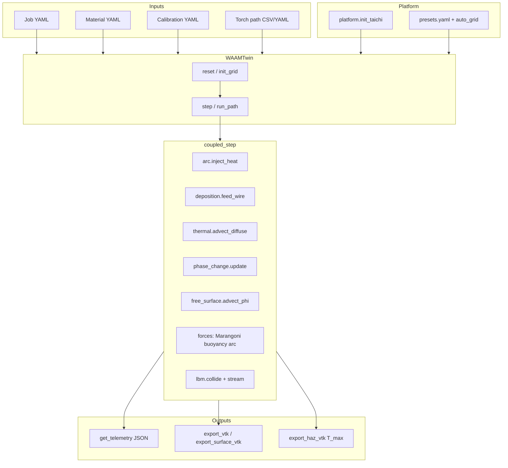

# waam_twin v2

GPU-accelerated WAAM melt-pool digital twin: **Taichi LBM** + **enthalpy–porosity** solidification + **VOF** free surface.  
Version **2.0.0** — portable presets, YAML materials, validated regression suite.

This repository is **standalone**. It lives inside the broader FYP22-01 WAAM stack for development but only tracks simulator code, jobs, materials, and docs. G-code cleaning / Flask UI remain in the parent project.

---

## What this project does

Predicts melt-pool **temperature**, **liquid fraction**, **Marangoni-driven flow**, and **bead geometry** for wire-arc additive manufacturing. Bead width and depth emerge from coupled physics (not drawn in as inputs). Calibration overlays (arc efficiency η, heat-loss factor, σ scale) tune process terms against reference runs.

**Explicit non-goals:** grain structure, residual-stress FEA, powder DEM, laser ray-tracing, full G-code CAM.

---

## Repository layout

```
waam_twin/                    ← git repository root (this folder)
├── README.md
├── requirements.txt
├── paths.py                  # PROJECT_ROOT = repo root
├── platform.py               # Taichi init, presets, auto_grid
├── twin.py                   # WAAMTwin orchestrator
├── grid.py                   # SoA Taichi fields
├── kernels.py                # Taichi kernels (migrating → physics/)
├── materials.py              # YAML alloy loader
├── calibration.py            # Process overlay scalars
├── job.py                    # Job YAML loader
├── torch_path.py             # CSV / waypoint torch paths
├── kuka_adapter.py           # KUKA TCP mm → sim metres (thin bridge)
├── benchmark.py              # Pool W/D measurement helpers
├── viewer.py                 # Interactive Taichi viewer
├── verify.py                 # → validation.run_all
├── config/
│   └── presets.yaml          # minimal | standard | high | ultra
├── jobs/
│   ├── examples/             # bead_on_plate, multi_bead, two_layer, …
│   └── paths/                # CSV torch paths
├── materials/
│   ├── schema.json
│   ├── placeholders/         # ER70S-6, SS316L, …
│   ├── validated/            # Calibrated alloys
│   ├── calibration/          # η, σ fits per process
│   └── user/                 # Local overrides (gitignored)
├── docs/                     # HARDWARE, MATERIALS, execution plan, validation
├── physics/                  # Modular operators (re-export kernels)
│   ├── thermal.py
│   ├── phase_change.py
│   ├── forces.py
│   ├── arc.py
│   ├── free_surface.py
│   ├── deposition.py
│   └── lbm.py
├── solvers/
│   └── coupled_step.py       # Single-timestep physics order
├── validation/               # Regression tests + baselines
├── tools/
│   ├── fit_calibration.py
│   ├── run_validation_matrix.py
│   └── benchmark_performance.py
└── .github/workflows/verify.yml
```

---

## Architecture

### Data flow



### Physics timestep (`solvers/coupled_step.py`)

Each `WAAMTwin.step(x, y, is_welding)` runs, in order:

1. Clear body forces  
2. Arc heat injection (Gaussian2D / Goldak)  
3. Wire feed + droplet tracers (on schedule)  
4. Thermal advection–diffusion + boundary losses  
5. Enthalpy–porosity phase update  
6. `T_max` / cooling rate  
7. Substrate growth + remelt (optional)  
8. VOF φ advection, reinit, flag update (optional)  
9. CSF tension, Marangoni, buoyancy, arc pressure, recoil  
10. LBM collide (SRT or MRT) + stream  
11. Tracer advection; buffer swap  

### Layer responsibilities

| Module | Role |
|--------|------|
| `platform.py` | CUDA → Vulkan → CPU fallback; VRAM-aware grid sizing |
| `grid.py` | Ping-pong LBM distributions, T, H, φ, flags, tracers |
| `physics/*` | Thin API over `kernels.py` (ongoing migration) |
| `kernels.py` | Taichi `@ti.kernel` implementations |
| `twin.py` | Public API: `from_preset`, `from_job`, `run_path`, exports |
| `validation/` | Kernel-only and process benchmarks |

---

## Installation

**Requirements:** Python 3.11+, Linux recommended (Taichi CPU/Vulkan/CUDA).

```bash
git clone <your-remote-url> waam_twin    # folder name must be waam_twin
cd waam_twin
pip install -r requirements.txt
```

### PYTHONPATH (important)

The Python package name is `waam_twin`, so the **parent** of this directory must be on `PYTHONPATH`:

```bash
cd waam_twin
export PYTHONPATH="$(cd .. && pwd)"
python -m waam_twin.validation.run_all
```

When this repo is nested inside FYP22-01 (as during local development):

```bash
cd /path/to/FYP22-01
export PYTHONPATH=.
python -m waam_twin.validation.run_all
```

---

## Quick start

### Bead-on-plate from a job file

```bash
export PYTHONPATH="$(cd .. && pwd)"   # or . if under FYP22-01
export WAAM_BACKEND=cpu
export WAAM_PRESET=minimal

python3 -c "
from waam_twin.platform import init_taichi
from waam_twin import WAAMTwin
init_taichi()
t = WAAMTwin.from_job('jobs/examples/bead_on_plate.yaml')
t.reset()
t.run_path('jobs/examples/bead_on_plate.yaml', n_steps=600)
print(t.get_telemetry())
"
```

### Preset-only (no job file)

```python
from waam_twin.platform import init_taichi
from waam_twin import WAAMTwin

init_taichi(backend="cpu")
twin = WAAMTwin.from_preset("standard", material="materials/validated/ER70S-6.v1.yaml")
twin.reset()
twin.step(0.015, 0.010, is_welding=True)
```

### Interactive viewer

```bash
export PYTHONPATH=...
export WAAM_PRESET=standard
python3 -m waam_twin.viewer
```

### VTK export

```python
twin.export_vtk("pool.vts")
twin.export_surface_vtk("bead_surface.vtp")
twin.export_haz_vtk("haz.vts")
```

Set `WAAM_HEADLESS=1` to skip VTK in batch runs.

---

## Jobs & materials

**Job YAML** (`jobs/examples/`) defines simulation preset, material path, process (I, V, travel, WFS), heat loss, torch path, and references:

| Key | Purpose |
|-----|---------|
| `reference` | Experimental macrograph targets (documentation) |
| `model_reference` | Simulator envelope used for CI gates |
| `calibration` | `materials/calibration/*.yaml` overlay |
| `torch_path` / `torch_path_csv` | Welding path waypoints |

**Materials** are YAML under `materials/` with `status: placeholder` or `calibrated`. Placeholders print a warning at load time.

See [docs/MATERIALS.md](docs/MATERIALS.md) and [docs/HARDWARE.md](docs/HARDWARE.md).

---

## Environment variables

| Variable | Values | Default |
|----------|--------|---------|
| `WAAM_BACKEND` | `auto`, `cpu`, `cuda`, `vulkan` | `auto` |
| `WAAM_PRESET` | `minimal`, `standard`, `high`, `ultra` | `standard` |
| `WAAM_VRAM_MB` | integer override | auto-detect |
| `WAAM_HEADLESS` | `0`, `1` | `0` |
| `WAAM_JOB` | path to job YAML | `jobs/examples/bead_on_plate.yaml` |
| `WAAM_FULL_VALIDATION` | `1` = process + soak tests | off |
| `WAAM_STANDARD_VALIDATION` | `1` = standard-dx pool test | off |
| `WAAM_BACKEND_MATRIX` | `1` = probe vulkan/cuda in smoke test | off |

---

## Validation

```bash
# Core CI (~30 s)
WAAM_BACKEND=cpu PYTHONPATH=... python3 -m waam_twin.validation.run_all

# Full suite (~2 min)
WAAM_FULL_VALIDATION=1 WAAM_BACKEND=cpu PYTHONPATH=... python3 -m waam_twin.validation.run_all

# Standard cell size pool gate
WAAM_STANDARD_VALIDATION=1 WAAM_BACKEND=cpu PYTHONPATH=... python3 -m waam_twin.validation.run_all
```

**Tools:**

```bash
python3 -m waam_twin.tools.fit_calibration --write
python3 -m waam_twin.tools.run_validation_matrix --quick
python3 -m waam_twin.tools.benchmark_performance
```

Legacy entry: `python3 -m waam_twin.verify` (delegates to `run_all`).

---

## KUKA / robot integration

`kuka_adapter.py` converts TCP coordinates (mm) to simulation metres. The parent FYP22-01 `kuka.py` robot loop may call `create_twin_from_env()` when the GPU twin is enabled:

```bash
export WAAM_JOB=jobs/examples/bead_on_plate.yaml
export WAAM_PRESET=minimal
```

No robot logic lives inside this package — only coordinate mapping and twin construction.

**G-code:** This repo accepts **CSV torch paths** and **YAML waypoints**. G-code cleaning/transpilation is borrowed from the parent FYP22-01 project (`gcode_pipeline.py`), not vendored here.

---

## Presets

| Preset | Typical dx | VRAM budget | Collision |
|--------|------------|-------------|-----------|
| `minimal` | 0.5 mm | 512 MB | SRT |
| `standard` | 0.3 mm | 2 GB | SRT |
| `high` | 0.2 mm | 8 GB | MRT |
| `ultra` | 0.15 mm | 16 GB | MRT |

Grid dimensions are computed by `auto_grid()` from `config/presets.yaml` and available memory.

---

## Telemetry schema

`get_telemetry()` returns a stable JSON-friendly dict (pool W/D, peak T, material status, porosity, …). Schema: [validation/telemetry_schema.json](validation/telemetry_schema.json).

---

## Further reading

- [Execution plan](docs/WAAM_TWIN_V2_EXECUTION_PLAN.md) — phases, task IDs, exit gates  
- [Validation report](docs/validation/VALIDATION_REPORT.md)  
- [ER70S-6 reference case](docs/validation/reference_case_ER70S6.md)  
- [LBM numerics](docs/physics/LBM.md)

---

## Relationship to FYP22-01

| In this repo | In parent FYP22-01 only |
|--------------|-------------------------|
| `waam_twin` simulator | Flask web UI (`main.py`) |
| Job / material YAML | `materials.json` (UI list) |
| `kuka_adapter` | `kuka.py` socket protocol |
| CSV torch paths | `gcode_pipeline.py`, `gcode_cleaner.py` |

Clone or copy this folder as the canonical simulator; point `PYTHONPATH` at its parent directory when running imports.
