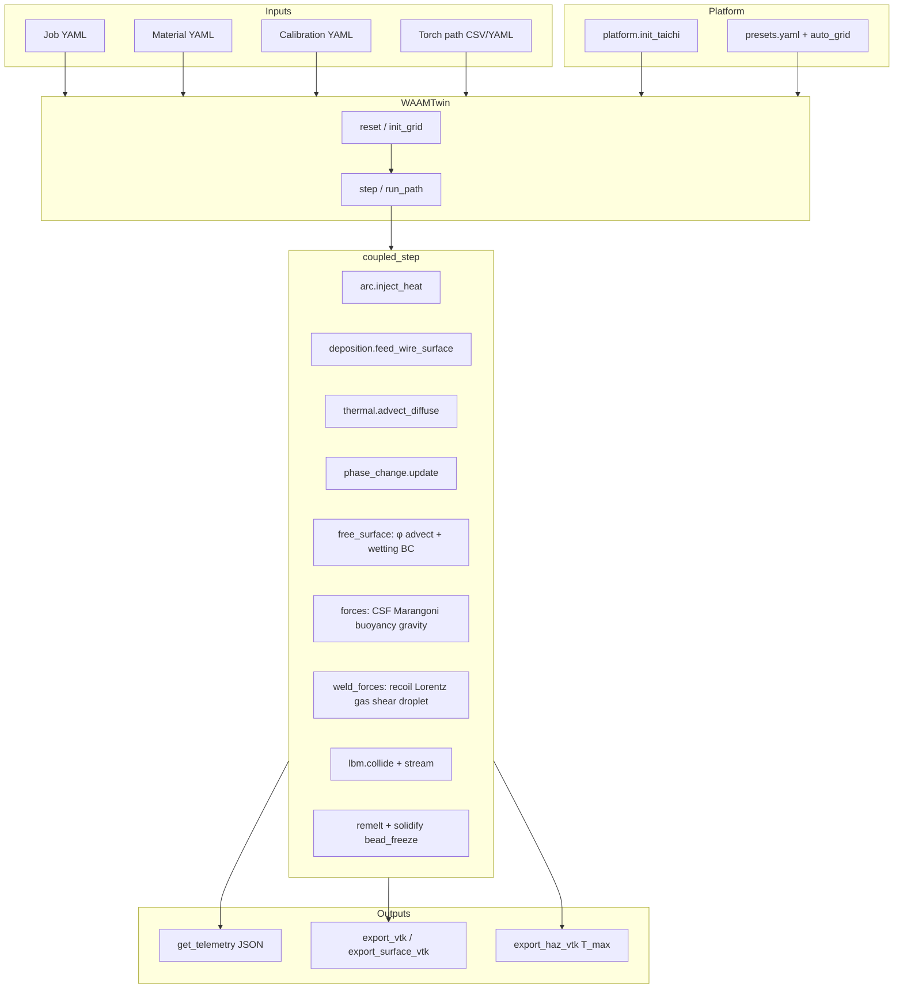

# waam_twin v2

GPU-accelerated WAAM melt-pool digital twin: **Taichi LBM** + **enthalpy–porosity** solidification + **VOF** free surface.  
Version **2.0.0** — portable presets, YAML materials, validated regression suite.

This repository is **standalone**. It lives inside the broader FYP22-01 WAAM stack for development but only tracks simulator code, jobs, materials, and docs. G-code cleaning / Flask UI remain in the parent project.

---

## What this project does

Predicts melt-pool **temperature**, **liquid fraction**, **Marangoni-driven flow**, and **bead geometry** for wire-arc additive manufacturing. Bead width and depth emerge from coupled physics (not drawn in as inputs). Calibration overlays (arc efficiency η, heat-loss factor, σ scale) tune process terms against reference runs.

**Explicit non-goals:** grain structure, residual-stress FEA, powder DEM, laser ray-tracing, full G-code CAM.

---

## Repository layout

```
waam_twin/                    ← git repository root (this folder)
├── README.md
├── requirements.txt
├── paths.py                  # PROJECT_ROOT = repo root
├── platform.py               # Taichi init, presets, auto_grid
├── twin.py                   # WAAMTwin orchestrator
├── grid.py                   # SoA Taichi fields
├── kernels.py                # Taichi kernels (migrating → physics/)
├── materials.py              # YAML alloy loader
├── calibration.py            # Process overlay scalars
├── job.py                    # Job YAML loader
├── torch_path.py             # CSV / waypoint torch paths
├── kuka_adapter.py           # KUKA TCP mm → sim metres (thin bridge)
├── benchmark.py              # Pool W/D measurement helpers
├── viewer/                   # Interactive Taichi GGUI viewer
├── verify.py                 # → validation.run_all
├── config/
│   └── presets.yaml          # minimal | standard | high | ultra
├── jobs/
│   ├── examples/             # bead_on_plate, multi_bead, two_layer, …
│   └── paths/                # CSV torch paths
├── materials/
│   ├── schema.json
│   ├── placeholders/         # ER70S-6, SS316L, …
│   ├── validated/            # Calibrated alloys
│   ├── calibration/          # η, σ fits per process
│   └── user/                 # Local overrides (gitignored)
├── docs/                     # HARDWARE, MATERIALS, execution plan, validation
├── physics/                  # Modular operators (re-export kernels)
│   ├── thermal.py
│   ├── phase_change.py
│   ├── forces.py
│   ├── arc.py
│   ├── free_surface.py
│   ├── deposition.py
│   ├── bead_geometry.py
│   ├── electrical_stickout.py
│   ├── weld_forces.py
│   └── lbm.py
├── export/                   # VTK bundles, probes, ParaView PVD sequences
│   ├── vtk_io.py
│   ├── bundle.py
│   └── meta.py
├── solvers/
│   └── coupled_step.py       # Single-timestep physics order
├── validation/               # Regression tests + baselines
├── tools/
│   ├── fit_calibration.py
│   ├── run_validation_matrix.py
│   └── benchmark_performance.py
└── .github/workflows/verify.yml
```

---

## Architecture

### Data flow



### Physics timestep (`solvers/coupled_step.py`)

Each `WAAMTwin.step(x, y, is_welding)` runs, in order:

1. Clear body forces; optional CTWD update  
2. Arc heat injection (Gaussian2D / Goldak) + enthalpy cap  
3. Wire droplet schedule → `feed_wire_surface` + tracer inject + droplet impact  
4. Thermal advection–diffusion + boundary losses  
5. `T_max` / cooling rate; enthalpy–porosity phase update  
6. VOF φ advection, reinit, **contact-angle wetting BC**, flag update (optional)  
7. CSF tension, Marangoni, **hydrostatic gravity**, thermal buoyancy  
8. Lorentz MHD, gas shear, arc pressure, recoil (optional flags)  
9. LBM collide (SRT or MRT) + stream; tracer advection  
10. **Remelt hot solid + solidify cooled metal** (bead freeze / substrate growth)  
11. Buffer swap  

See [docs/BEAD_GEOMETRY_PHYSICS_SPEC.md](docs/BEAD_GEOMETRY_PHYSICS_SPEC.md) and [docs/weld_pool_physics.md](docs/weld_pool_physics.md).

### Layer responsibilities

| Module | Role |
|--------|------|
| `platform.py` | CUDA → Vulkan → CPU fallback; VRAM-aware grid sizing |
| `grid.py` | Ping-pong LBM distributions, T, H, φ, flags, tracers |
| `physics/*` | Thin API over `kernels.py` (ongoing migration) |
| `kernels.py` | Taichi `@ti.kernel` implementations |
| `twin.py` | Public API: `from_preset`, `from_job`, `run_path`, exports |
| `validation/` | Kernel-only and process benchmarks |

---

## Installation

**Requirements:** Python 3.11+, Linux recommended (Taichi CPU/Vulkan/CUDA).

```bash
git clone <your-remote-url> waam_twin    # folder name must be waam_twin
cd waam_twin
pip install -r requirements.txt
```

### PYTHONPATH (important)

The Python package name is `waam_twin`, so the **parent** of this directory must be on `PYTHONPATH`:

```bash
cd waam_twin
export PYTHONPATH="$(cd .. && pwd)"
python -m waam_twin.validation.run_all
```

When this repo is nested inside FYP22-01 (as during local development):

```bash
cd /path/to/FYP22-01
export PYTHONPATH=.
python -m waam_twin.validation.run_all
```

---

## Quick start

### Bead-on-plate from a job file

```bash
export PYTHONPATH="$(cd .. && pwd)"   # or . if under FYP22-01
export WAAM_BACKEND=cpu
export WAAM_PRESET=minimal

python3 -c "
from waam_twin.platform import init_taichi
from waam_twin import WAAMTwin
init_taichi()
t = WAAMTwin.from_job('jobs/examples/bead_on_plate.yaml')
t.reset()
t.run_path('jobs/examples/bead_on_plate.yaml', n_steps=600)
print(t.get_telemetry())
"
```

### Preset-only (no job file)

```python
from waam_twin.platform import init_taichi
from waam_twin import WAAMTwin

init_taichi(backend="cpu")
twin = WAAMTwin.from_preset("standard", material="materials/validated/ER70S-6.v1.yaml")
twin.reset()
twin.step(0.015, 0.010, is_welding=True)
```

### Interactive viewer

Real-time **Taichi GGUI** particle view of the melt pool (voxel-based, not ParaView quality). Defaults to the calibrated bead-on-plate job (VOF + heat loss + calibration overlay).

```bash
cd FYP22-01   # parent on PYTHONPATH
export PYTHONPATH=.
export WAAM_BACKEND=cuda   # or cpu / vulkan

# Calibrated job (recommended)
python3 -m waam_twin.viewer --job jobs/examples/bead_on_plate.yaml

# Multi-bead path job
python3 -m waam_twin.viewer --job jobs/examples/multi_bead.yaml

# Preset-only demo (no job file)
python3 -m waam_twin.viewer --preset minimal --material materials/validated/ER70S-6.v1.yaml
```

| Key | Action |
|-----|--------|
| `M` | Cycle view: Temperature / HAZ / Velocity / Vorticity / Body force (+ force arrows in body-force mode) |
| `V` | Cycle flow overlay: off / velocity arrows / streamlines |
| `B` / `H` / `F` | Filter: all metal / solid-only / surface (φ band) |
| `N` | Toggle φ surface shell (T-colored) vs particles |
| `C` / `Z` | Toggle Y / Z cross-section clip |
| `T` / `O` | Toggle porosity tracers / torch marker |
| `G` | Full research VTK bundle → `viewer_output/bundle_step_*/` |
| `I` | Pick probe at camera lookat; **T(t)** panel updates live |
| `P` | Add probe at torch (CSV on **`G`** export) |
| `R` | Reset simulation |
| `+` / `-` | More / fewer physics steps per frame |
| `S` | Screenshot PNG → `viewer_output/` |
| `SPACE` | Pause / resume |
| `ESC` | Exit |

HUD shows pool W/D, peak T, Marangoni speed, liquid cell count, bead height, deposited mass, and a **T(t) probe** sparkline when a probe is active (`P`, `I`, or job `probes:`).

Temperature view colors hot liquid, warm HAZ, substrate (dark), and frozen bead (bronze) — not flat grey on solids.

#### Resolution tuning

Two separate knobs: **simulation grid** (physics) vs **particle size** (display only).

| What | Where | Effect |
|------|--------|--------|
| **Grid / cell size** | Job YAML `simulation.preset` or viewer `--preset` | `minimal` → dx≈0.5 mm, `standard` → 0.3 mm, `high` → 0.2 mm |
| **Preset definitions** | [`config/presets.yaml`](config/presets.yaml) | Edit `target_dx_mm`, `domain_mm`, `vram_budget_mb` per tier |
| **Viewer override** | CLI | `--preset standard` overrides job preset without editing YAML |
| **Particle “ball” size** | CLI | `--particle-scale 0.25` (fraction of cell width; default `0.35`) |

Example — finer physics + smaller particles:

```bash
python3 -m waam_twin.viewer \
  --job jobs/examples/bead_on_plate.yaml \
  --preset standard \
  --particle-scale 0.28
```

Or edit the job file:

```yaml
simulation:
  preset: standard   # was minimal — 0.3 mm cells, larger grid
  enable_vof: true
```

**VRAM:** `standard` needs ~2 GB GPU budget; `high` ~8 GB. Your RTX-class laptop can usually run `standard` on CUDA.

### VTK export & ParaView

**Single snapshot** (one time step — ParaView play will not animate):

```python
twin.export_vtk_full("pool.vti", tiers=(0, 1, 2, 3))
twin.export_surface_vtk("bead_surface.vtp")
twin.export_research_bundle("run_out/")   # volume + surface + tracers + meta + telemetry JSON
```

Press **`G`** in the viewer for a full bundle under `viewer_output/bundle_step_*/`.

**Time-series / build-up animation** — use the export CLI, then open the **`.pvd`** file:

```bash
python3 -m waam_twin.export \
  --job jobs/examples/bead_on_plate.yaml \
  --preset standard \
  --steps 5000 \
  --every 100 \
  --max-frames 50 \
  --out viewer_output/my_bead_run

# ParaView: File → Open → viewer_output/my_bead_run/sequence.pvd → Apply → Play
```

Each frame folder contains:

| File | Contents |
|------|----------|
| `volume_step_*.vti` | `Temperature_K`, `Liquid_Fraction`, `VOF_phi`, `Cell_Flags`, `T_max_K`, velocities, optional forces |
| `surface_step_*.vtp` | φ / f_l = 0.5 isosurface (bead crown) |
| `telemetry_step_*.json` | `bead_height_mm`, `deposited_mass_g`, pool W/D, … |
| `meta_step_*.json` | Grid, material, physics flags, unit conversions |

**ParaView tips**

- Open **`sequence.pvd`**, not a lone `volume_step_*.vti`.
- Turn **Z clip off** in the viewer (`Z`) before exporting if you need the full crown in screenshots.
- Threshold `Cell_Flags` (0 = fluid, 1 = solid) and clip Z above substrate to isolate deposited bead.
- Legacy `.vts` paths are rewritten to `.vti`. Set `WAAM_HEADLESS=1` to skip VTK in batch runs.

Full field inventory (names, units, computation): [docs/VTK_EXPORT.md](docs/VTK_EXPORT.md). Implementation spec: [docs/DIAGNOSTICS_AND_VTK_SPEC.md](docs/DIAGNOSTICS_AND_VTK_SPEC.md).

### Bead geometry physics (job flags)

Example [`jobs/examples/bead_on_plate.yaml`](jobs/examples/bead_on_plate.yaml):

| Flag | Effect |
|------|--------|
| `enable_wetting` | Contact-angle CSF at substrate triple line |
| `enable_hydrostatic_gravity` | ρg flattening of liquid crest |
| `enable_bead_freeze` | Solidify cooled metal behind arc (bead crown) |
| `enable_recoil` | Vapor recoil pressure on pool surface |
| `enable_lorentz` | MHD body force (J×B) |
| `enable_gas_shear` | Shielding-gas traction on free surface |
| `enable_droplet_impact_pressure` | Droplet momentum pulse on impact |
| `enable_ctwd` | Stick-out I²R wire preheat (open-loop CTWD) |

New droplet / impact knobs:

```yaml
process:
  transfer_mode: globular   # globular | spray | pulsed | auto
  droplet_freq_hz: 44.0     # optional base detachment rate
  pulse_frequency_hz: 90.0  # for pulsed transfer
  droplet_size_jitter: 0.12 # deterministic ± modulation
  impact_lead_angle_deg: 8.0

deposition:
  trailing_solidify_lookback_mm: 2.5
  trailing_solidify_temp_margin_K: 35.0
```

`transfer_mode` changes detachment period, drop mass, and impact speed heuristically; the trailing-solidify settings help clamp the far wake back to solid once it cools below a mild superheat margin.

Spec: [docs/BEAD_GEOMETRY_PHYSICS_SPEC.md](docs/BEAD_GEOMETRY_PHYSICS_SPEC.md).

---

## Jobs & materials

**Job YAML** (`jobs/examples/`) defines simulation preset, material path, process (I, V, travel, WFS), heat loss, torch path, and references:

| Key | Purpose |
|-----|---------|
| `reference` | Experimental macrograph targets (documentation) |
| `model_reference` | Simulator envelope used for CI gates |
| `calibration` | `materials/calibration/*.yaml` overlay |
| `torch_path` / `torch_path_csv` | Welding path waypoints |

**Materials** are YAML under `materials/` with `status: placeholder` or `calibrated`. Placeholders print a warning at load time.

See [docs/MATERIALS.md](docs/MATERIALS.md) and [docs/HARDWARE.md](docs/HARDWARE.md).

---

## Environment variables

| Variable | Values | Default |
|----------|--------|---------|
| `WAAM_BACKEND` | `auto`, `cpu`, `cuda`, `vulkan` | `auto` |
| `WAAM_PRESET` | `minimal`, `standard`, `high`, `ultra` | `standard` |
| `WAAM_VRAM_MB` | integer override | auto-detect |
| `WAAM_HEADLESS` | `0`, `1` | `0` |
| `WAAM_JOB` | path to job YAML | `jobs/examples/bead_on_plate.yaml` (under `waam_twin/`) |
| `WAAM_FULL_VALIDATION` | `1` = process + soak tests | off |
| `WAAM_STANDARD_VALIDATION` | `1` = standard-dx pool test | off |
| `WAAM_BACKEND_MATRIX` | `1` = probe vulkan/cuda in smoke test | off |

---

## Validation

```bash
# Core CI (~30 s)
WAAM_BACKEND=cpu PYTHONPATH=... python3 -m waam_twin.validation.run_all

# Full suite (~2 min)
WAAM_FULL_VALIDATION=1 WAAM_BACKEND=cpu PYTHONPATH=... python3 -m waam_twin.validation.run_all

# Standard cell size pool gate
WAAM_STANDARD_VALIDATION=1 WAAM_BACKEND=cpu PYTHONPATH=... python3 -m waam_twin.validation.run_all
```

**Tools:**

```bash
python3 -m waam_twin.tools.fit_calibration --write
python3 -m waam_twin.tools.run_validation_matrix --quick
python3 -m waam_twin.tools.benchmark_performance
```

Legacy entry: `python3 -m waam_twin.verify` (delegates to `run_all`).

---

## KUKA / robot integration

**Coordinate frame:** `jobs/frames/weld_table.yaml` (or `frame:` in job YAML, `WAAM_FRAME` env).

**G-code → twin path:**

```bash
# From FYP22-01 (parent on PYTHONPATH):
export PYTHONPATH=.
python3 -m waam_twin.tools.gcode_to_torch_csv part.gcode -o waam_twin/jobs/paths/part.csv
```

Flask upload (`POST /api/gcode`) also writes `waam_twin/jobs/paths/<PROGRAM>.csv` automatically.

**Job wiring:**

```yaml
frame: jobs/frames/weld_table.yaml
simulation:
  use_torch_z: true   # map robot Z + CTWD → arc height
torch_path_csv: jobs/paths/part.csv
```

**Live MockKUKA:** `kuka.py` calls `kuka_adapter.step_from_tcp()` with `$POS_ACT` mm values.

```bash
export WAAM_JOB=jobs/examples/bead_on_plate.yaml
export WAAM_FRAME=jobs/frames/weld_table.yaml
export WAAM_PRESET=minimal
```

No robot logic lives inside this package — only frame mapping, CSV paths, and twin construction.

---

## Presets

| Preset | Typical dx | VRAM budget | Collision |
|--------|------------|-------------|-----------|
| `minimal` | 0.5 mm | 512 MB | SRT |
| `standard` | 0.3 mm | 2 GB | SRT |
| `high` | 0.2 mm | 8 GB | MRT |
| `ultra` | 0.15 mm | 16 GB | MRT |

Grid dimensions are computed by `auto_grid()` from `config/presets.yaml` and available memory.

---

## Telemetry schema

`get_telemetry()` returns a stable JSON-friendly dict: pool W/D, peak T, `n_liquid_cells`, `bead_height_mm`, `deposited_mass_g`, `mass_balance_ratio`, porosity, CTWD, toe angle, …

Schema: [validation/telemetry_schema.json](validation/telemetry_schema.json).

---

## Further reading

- [Bead geometry physics spec](docs/BEAD_GEOMETRY_PHYSICS_SPEC.md) — wetting, deposition, freeze, CTWD  
- [Weld pool forces](docs/weld_pool_physics.md) — Marangoni, Lorentz, recoil, droplets  
- [VTK & diagnostics spec](docs/DIAGNOSTICS_AND_VTK_SPEC.md) — export tiers, ParaView workflow  
- [Execution plan](docs/WAAM_TWIN_V2_EXECUTION_PLAN.md) — phases, task IDs, exit gates  
- [Validation report](docs/validation/VALIDATION_REPORT.md)  
- [ER70S-6 reference case](docs/validation/reference_case_ER70S6.md)  
- [LBM numerics](docs/physics/LBM.md)

---

## Relationship to FYP22-01

| In `waam_twin/` (this repo) | In parent FYP22-01 only |
|-----------------------------|-------------------------|
| `config/`, `jobs/`, `materials/`, `docs/` | Flask UI (`main.py`), `kuka.py` |
| Job / material YAML | Parent `materials.json` (UI wire list) |
| `kuka_adapter.py` | `waam_physics.py`, `gcode_pipeline.py` |

When nested under FYP22-01: `export PYTHONPATH=.` on the **parent**. Paths like `jobs/examples/…` resolve inside **`waam_twin/`** via `paths.resolve_project_path()`.

See also [../README_WAAM_TWIN.md](../README_WAAM_TWIN.md) for a short FYP22-01 entry point.
