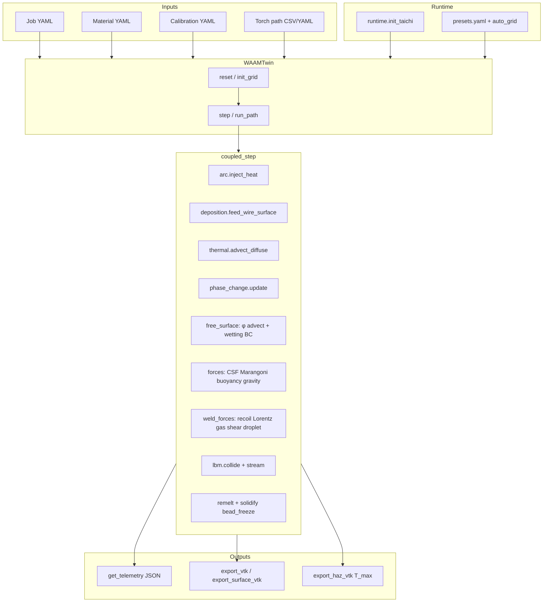

# waam_twin v2

GPU-accelerated WAAM melt-pool digital twin: **Quadrants LBM** + **enthalpy–porosity** solidification + **VOF** free surface.  
Version **2.0.0** — portable presets, YAML materials, validated regression suite.

The compiler is [Quadrants](https://github.com/Genesis-Embodied-AI/quadrants) (independent Taichi fork). Kernel source still uses the `ti` spelling via `waam_twin.compiler`.

---

## What this project does

Predicts melt-pool **temperature**, **liquid fraction**, **Marangoni-driven flow**, and **bead geometry** for wire-arc additive manufacturing. Bead width and depth emerge from coupled physics (not drawn in as inputs). Calibration overlays (arc efficiency η, heat-loss factor, σ scale) tune process terms against reference runs.

**Explicit non-goals:** grain structure, residual-stress FEA, powder DEM, laser ray-tracing, full G-code CAM.

---

## Repository layout

```
waam_twin/                    ← git repository root (this folder)
├── README.md
├── requirements.txt
├── paths.py                  # PROJECT_ROOT = repo root
├── runtime.py                # Quadrants init, presets, auto_grid
├── twin.py                   # WAAMTwin orchestrator
├── grid.py                   # SoA Quadrants fields
├── compiler.py               # Quadrants import; kernels keep `ti` spelling
├── kernels/                  # GPU kernels (@ti.kernel on Quadrants)
├── materials.py              # YAML alloy loader
├── calibration.py            # Process overlay scalars
├── job.py                    # Job YAML loader
├── torch_path.py             # CSV / waypoint torch paths
├── kuka_adapter.py           # KUKA TCP mm → sim metres (thin bridge)
├── benchmark.py              # Pool W/D measurement helpers
├── viewer/                   # Interactive PyVista melt-pool viewer
├── verify.py                 # → validation.run_all
├── config/
│   └── presets.yaml          # minimal | standard | high | ultra
├── jobs/
│   ├── examples/             # bead_calibrate, locks/, example.yaml, …
│   └── paths/                # CSV torch paths (bead_calibrate.csv, …)
├── materials/
│   ├── schema.json
│   ├── placeholders/         # ER70S-6, SS316L, …
│   ├── validated/            # Calibrated alloys
│   ├── calibration/          # η, σ fits per process
│   └── user/                 # Local overrides (gitignored)
├── Dockerfile                # GPU headless image (Docker-capable HPC)
├── docs/                     # HARDWARE, HPC, MATERIALS, VTK, LBM, weld-pool physics
├── scripts/hpc/              # SLURM templates + headless run_batch.py
├── runs/                     # Batch outputs (gitignored contents)
├── logs/                     # SLURM / local logs (gitignored contents)
├── physics/                  # Host-side orchestration (kernels/ is the GPU home)
│   ├── thermal.py
│   ├── phase_change.py
│   ├── forces.py
│   ├── arc.py
│   ├── free_surface.py
│   ├── deposition.py
│   ├── bead_geometry.py
│   ├── electrical_stickout.py
│   ├── weld_forces.py
│   └── lbm.py
├── export/                   # VTK bundles, probes, ParaView PVD sequences
│   ├── vtk_io.py
│   ├── bundle.py
│   └── meta.py
├── solvers/
│   └── coupled_step.py       # Single-timestep physics order
├── validation/               # Regression tests + baselines
├── tools/
│   ├── fit_calibration.py
│   ├── run_validation_matrix.py
│   └── benchmark_performance.py
└── .github/workflows/verify.yml
```

---

## Architecture

### Data flow


```mermaid
flowchart TB
  subgraph inputs [Inputs]
    JOB[Job YAML]
    MAT[Material YAML]
    CAL[Calibration YAML]
    PATH[Torch path CSV/YAML]
  end

  subgraph runtime [Runtime]
    INIT[runtime.init_taichi]
    PRE[presets.yaml + auto_grid]
  end

  subgraph twin [WAAMTwin]
    RESET[reset / init_grid]
    STEP[step / run_path]
  end

  subgraph solver [coupled_step]
    ARC[arc.inject_heat]
    DEP[deposition.feed_wire_surface]
    TH[thermal.advect_diffuse]
    PC[phase_change.update]
    VOF[free_surface: φ advect + wetting BC]
    FRC[forces: CSF Marangoni buoyancy gravity]
    WELD[weld_forces: recoil Lorentz gas shear droplet]
    LBM[lbm.collide + stream]
    FRZ[remelt + solidify bead_freeze]
  end

  subgraph outputs [Outputs]
    TEL[get_telemetry JSON]
    VTK[export_vtk / export_surface_vtk]
    HAZ[export_haz_vtk T_max]
  end

  JOB --> twin
  MAT --> twin
  CAL --> twin
  PATH --> twin
  INIT --> twin
  PRE --> twin
  RESET --> STEP
  STEP --> solver
  solver --> TEL
  solver --> VTK
  solver --> HAZ
```

### Physics timestep (`solvers/coupled_step.py`)

Each `WAAMTwin.step(x, y, is_welding)` runs, in order:

1. Clear body forces; optional CTWD update  
2. Arc heat injection (Gaussian2D / Goldak) + enthalpy cap  
3. Wire droplet schedule → `feed_wire_surface` + tracer inject + droplet impact  
4. Thermal advection–diffusion + boundary losses  
5. `T_max` / cooling rate; enthalpy–porosity phase update  
6. VOF φ advection, reinit, **contact-angle wetting BC**, flag update (optional)  
7. CSF tension, Marangoni, **hydrostatic gravity**, thermal buoyancy  
8. Lorentz MHD, gas shear, arc pressure, recoil (optional flags)  
9. LBM collide (SRT or MRT) + stream; tracer advection  
10. **Remelt hot solid + solidify cooled metal** (bead freeze / substrate growth)  
11. Buffer swap  

See [docs/weld_pool_physics.md](docs/weld_pool_physics.md), [`solvers/coupled_step.py`](solvers/coupled_step.py), and the **Jobs & materials** section below for bead/deposition flags.

### Layer responsibilities

| Module | Role |
|--------|------|
| `runtime.py` | CUDA → ROCm/HIP → Vulkan → CPU; VRAM-aware grid sizing |
| `grid.py` | Ping-pong LBM distributions, T, H, φ, flags, tracers |
| `physics/*` | Orchestration / host-side force and material helpers |
| `kernels/` | GPU home: all Quadrants `@ti.kernel` implementations |
| `compiler.py` | Quadrants import; `ti` alias for kernel source |
| `twin.py` | Public API: `from_preset`, `from_job`, `run_path`, exports |
| `validation/` | Kernel-only and process benchmarks |

---

## Installation

**Requirements:** Python **3.10+** (3.11 recommended), Linux preferred (Quadrants CPU/CUDA/ROCm/Vulkan).

```bash
git clone https://github.com/THEDARKDEACON/waam_solver.git waam_twin
cd waam_twin
python3 -m venv .venv && source .venv/bin/activate
pip install -U pip
pip install -e .
# VTK export (optional): pip install -e ".[export]"
# Offline collision derivation (optional): pip install -e ".[derive]"
```

Editable install is the preferred path. It avoids the old "clone folder must be
named `waam_twin`" constraint. That naming rule still matters only if you skip
installation and rely on `PYTHONPATH` import resolution instead.

After install, verify the GPU backend before any long job:

```bash
nvidia-smi
python -c "from waam_twin.compiler import ti; ti.init(arch=ti.cuda); print(ti.cfg.arch)"
```

> Backend / preset helpers: `from waam_twin.runtime import init_taichi`
> (module file: `runtime.py`).

### CUDA / GPU backends

Quadrants CUDA/ROCm wheels are tied to a driver + toolkit series. Check the
init banner rather than assuming the first GPU arch worked.

| Check | Command |
|-------|---------|
| NVIDIA driver | `nvidia-smi` |
| AMD driver | `rocm-smi` |
| CUDA usable | `python -c "from waam_twin.compiler import ti; ti.init(arch=ti.cuda); print(ti.cfg.arch)"` |
| ROCm usable | `python -c "from waam_twin.compiler import ti; ti.init(arch=ti.amdgpu); print(ti.cfg.arch)"` |
| Preferred backend | `export WAAM_BACKEND=cuda` (or `amdgpu` / `vulkan` / `cpu`) |
| Sticky override | `export WAAM_FORCE_BACKEND=cuda` (wins over tests that reset `WAAM_BACKEND`) |

If `ti.init(arch=ti.cuda)` raises, install Quadrants matching your driver
(`pip install 'quadrants>=1.3.0,<1.4'`). Native ROCm is `WAAM_BACKEND=amdgpu`;
Vulkan remains a cross-vendor fallback.

### PYTHONPATH (important)

The import name is `waam_twin`, so the **parent of this folder** must be on `PYTHONPATH`:

```bash
# Standalone clone (repo root = waam_twin/)
cd waam_twin
export PYTHONPATH="$(cd .. && pwd)"
python -m waam_twin.validation.run_all

# Nested under FYP22-01 during local development
cd /path/to/FYP22-01
export PYTHONPATH=.
python -m waam_twin.validation.run_all
```

---

## Quick start

### Bead calibration / bead-on-plate

Prefer **`jobs/examples/bead_calibrate.yaml`** for deposition + pool W/D gates
(fixed modest domain, flow-tier forces, tuned vs macrograph ≈7×3 mm).  
Use **`bead_on_plate.yaml`** for interactive playground (same heat schedule by default).

```bash
export PYTHONPATH="$(cd .. && pwd)"   # or . if under FYP22-01
export WAAM_BACKEND=cuda              # cpu also fine for short smoke runs

python3 -c "
from waam_twin.runtime import init_taichi
from waam_twin import WAAMTwin
init_taichi()
t = WAAMTwin.from_job('jobs/examples/bead_calibrate.yaml')
t.reset()
t.run_path('jobs/examples/bead_calibrate.yaml', n_steps=800)
print(t.get_telemetry())
"
```

**Power convention:** job `current_A` × `voltage_V` → electrical `Q_w`; kernels deposit
\(\eta\cdot Q_w\) each step (do **not** bake \(\eta\) into `Q_w` twice). Goldak axes set
geometry only; amplitude is renormalized so \(\int q\,dV=\eta\,V\,I\).

### Preset-only (no job file)

```python
from waam_twin.runtime import init_taichi
from waam_twin import WAAMTwin

init_taichi(backend="cpu")
twin = WAAMTwin.from_preset("standard", material="materials/validated/ER70S-6.v1.yaml")
twin.reset()
twin.step(0.015, 0.010, is_welding=True)
```

### Where to run (pick one)

| Environment | Best for | Entry point |
|-------------|----------|-------------|
| **Local desktop** | Interactive debugging, PyVista viewer | `python -m waam_twin.viewer …` |
| **Colab / Jupyter** | Editable jobs, Drive sync | `notebooks/cloud_production_workflow.ipynb` |
| **HPC + Docker** | Higher-resolution beads (this site) | `Dockerfile` + copy-paste below |
| **HPC venv** | Fallback if Docker unavailable | modules + `.venv` below |

### HPC — production bead run (copy-paste)

For operators with a **GPU** terminal. Do **not** use the interactive viewer on
HPC (no display). Full detail: [docs/HPC.md](docs/HPC.md).

#### A) Docker (preferred when Docker + GPUs are allowed)

```bash
cd /path/to/waam_twin          # folder with Dockerfile + pyproject.toml

docker build -t waam-twin:latest .

mkdir -p runs
docker run --rm --gpus all \
  -e WAAM_BACKEND=cuda \
  -v "$PWD/runs:/app/runs" \
  waam-twin:latest \
  python scripts/hpc/run_batch.py \
    --job jobs/examples/bead_on_plate_hires.yaml \
    --n-steps auto \
    --out runs/bead_on_plate_hires
```

Outputs on the host:

```text
runs/bead_on_plate_hires/final.pvd
runs/bead_on_plate_hires/sequence/sequence.pvd
runs/bead_on_plate_hires/bundle/
```

ParaView: **File → Open → `sequence.pvd` → Apply → Play**, or open `final.pvd`.

#### B) venv + modules (no Docker)

Replace `/path/to/waam_twin` with the real clone path. Module names are
site-specific — run `module avail` if unsure.

```bash
cd /path/to/waam_twin
module load python/3.11          # edit to your site's module
module load cuda/12.2            # edit to your site's module

python3 -m venv .venv
source .venv/bin/activate
pip install -U pip
pip install -e .

nvidia-smi
python -c "from waam_twin.compiler import ti; ti.init(arch=ti.cuda); print(ti.cfg.arch)"

export WAAM_BACKEND=cuda
mkdir -p runs
python scripts/hpc/run_batch.py \
  --job jobs/examples/bead_on_plate_hires.yaml \
  --n-steps auto \
  --out runs/bead_on_plate_hires
```

`module load` only selects the centre’s Python/CUDA for this shell; the venv +
`pip install -e .` installs the project.

| Flag | Meaning |
|------|---------|
| `--job …_hires.yaml` | Finer mesh (`dx_mm: 0.25`, `preset: high`) vs default `bead_on_plate.yaml` (`dx_mm: 0.5`) |
| `--n-steps auto` | Run until the torch path finishes (do not under-size steps) |
| `--out …` | Writes telemetry + VTK + ParaView PVD under `runs/` |
| `--sequence-every N` | VTK frame every N steps + `sequence.pvd` (default **500**; `0` = final only) |

#### C) Optional — coarser smoke first

If the hires job OOMs or is too slow, prove the pipeline with the default job
(Docker or venv — same `run_batch.py` args):

```bash
python scripts/hpc/run_batch.py \
  --job jobs/examples/bead_on_plate.yaml \
  --n-steps auto \
  --out runs/bead_on_plate
```

#### D) Curbing OOM (out-of-memory) errors

VRAM blow-ups are normal when the mesh is too fine for the GPU. Try these **in
order** (cheapest first):

**A. Lower the hardware preset** (fewer cells / smaller VRAM budget):

```bash
# Docker:
docker run --rm --gpus all -e WAAM_BACKEND=cuda -v "$PWD/runs:/app/runs" waam-twin:latest \
  python scripts/hpc/run_batch.py \
  --job jobs/examples/bead_on_plate_hires.yaml \
  --preset standard \
  --n-steps auto \
  --out runs/bead_on_plate_hires_std

# venv:
python scripts/hpc/run_batch.py \
  --job jobs/examples/bead_on_plate_hires.yaml \
  --preset standard \
  --n-steps auto \
  --out runs/bead_on_plate_hires_std
```

Ladder: `ultra` → `high` → `standard` → `minimal`.

**B. Increase `dx_mm` in the job** (coarser cells → fewer cells):

Edit `jobs/examples/bead_on_plate_hires.yaml` (or your copy):

```yaml
simulation:
  preset: high
  dx_mm: 0.35          # was 0.25; larger dx = less VRAM
  # domain_mm: [60, 60, 22]   # optional: shrink domain too
```

**C. Cap `max_cells` / `vram_budget_mb` in the preset file**

Edit the package presets (this is what `auto_grid` reads):

```text
waam_twin/config/presets.yaml
```

Example — keep `high` but refuse huge grids:

```yaml
high:
  vram_budget_mb: 8192
  max_cells: 40000000    # lower from 120000000 if you still OOM
  target_dx_mm: 0.2
  max_tracers: 50000
  use_srt: false
```

The requested `dx` is allocated as written. Halving `dx` multiplies the cell
count by 8. The preset does not coarsen `dx` or refuse the grid; the device
OOMs if the mesh does not fit. Domain size changes only by editing the job.

Also helps: `--sequence-every 0` (less peak memory from export buffers), fewer
`max_tracers`, or a smaller `domain_mm` in the job.

> Note: if your tree also has `FYP22-01/config/presets.yaml`, that is a **legacy**
> copy. Runtime uses **`waam_twin/config/presets.yaml`** unless a notebook
> session redirects it.

#### Notes for operators

- Stay in the **`waam_twin` repo root** (the folder with `pyproject.toml`).
- Job path is `jobs/examples/...`, **not** `waam_twin/jobs/...` (that form is only when your cwd is the parent `FYP22-01` folder on a laptop).
- The log line `[grid]` prints the cell count and the field-size estimate before allocation.
- Leave the terminal open until the process exits; outputs are under `runs/`.

More detail: [docs/HPC.md](docs/HPC.md), [docs/HARDWARE.md](docs/HARDWARE.md).

### Notebook / Colab workflow

The production notebook is `notebooks/cloud_production_workflow.ipynb`.

Use it when you want:

- Google Drive persistence
- in-run VTK sequence export
- editable job/path/preset cells without touching tracked example files

For **cluster GPU beads**, prefer the HPC copy-paste section above.

The notebook keeps three editable text blocks in memory, then writes them into a session workspace inside the repo:

| Notebook variable | Writes to | Purpose |
|------------------|-----------|---------|
| `JOB_YAML` | `jobs/notebook_session/job.yaml` | full run configuration |
| `TORCH_PATH_CSV` | `jobs/notebook_session/torch_path.csv` | welding path waypoints |
| `PRESETS_YAML` | `jobs/notebook_session/presets.yaml` | optional preset overrides for that session |

`apply_job_config()` materializes those cells and returns the `job` used by
`run_job(...)` and `run_job_live_view(...)`.

Current notebook assumptions:

- install from the repo root with `pip install -e .`
- presets are hardware/VRAM profiles only; geometry stays in `JOB_YAML`
- `strict_mode: true` is recommended for long cloud runs
- session jobs are schema-validated when loaded
- `PRESET_OVERRIDE = None` means **use `simulation.preset` from the job** (not the `WAAM_PRESET` env default)

Main notebook run controls:

| Variable | Meaning |
|----------|---------|
| `PRESET_OVERRIDE` | runtime preset override without editing the job YAML |
| `N_STEPS` | total simulation steps for a batch run (**see warning below**) |
| `EXPORT_BUNDLE` | write a final research bundle |
| `EXPORT_SEQUENCE` | export time-series VTK frames during the main run |
| `SEQUENCE_EVERY` | export every N steps when sequence export is enabled |
| `RESET_TAICHI_EACH_RUN` | reinitialize Quadrants before each run |
| `FREE_VRAM_AFTER_RUN` | release memory after the run completes |
| `KEEP_TWIN_IN_MEMORY` | keep the last twin alive for inspection/debugging |
| `SYNC_TO_DRIVE` | copy outputs to mounted Google Drive |
| `SYNC_EACH_EXPORT` | sync after each export instead of only at the end |

**`N_STEPS` warning:** the torch advances at real travel speed using fixed LBM
`dt` (`dt = 0.1 · dx`). A fixed step count that is too small **ends mid-bead**.
Steps needed ≈ `path_length_m / (travel_speed_m_s · dt)`. On HPC, prefer
`--n-steps auto` / `run_path(..., n_steps=None)` so the path is fully covered.

Path behavior is intentionally consistent:

- local CLI/Python runs usually point at `jobs/examples/...`
- notebook runs usually point at `jobs/notebook_session/...`
- both are resolved relative to the `waam_twin` repo root

### Interactive viewer

Real-time **PyVista** particle view of the melt pool (voxel-based, not ParaView quality).
Needs `pip install -e ".[export]"`. Quadrants has no GGUI.

```bash
# From FYP22-01 parent (PYTHONPATH=.) or any parent of waam_twin/
# Prefer: pip install -e . inside waam_twin/ (then PYTHONPATH is optional)
export PYTHONPATH=.
export WAAM_BACKEND=cuda   # or cpu / vulkan / amdgpu

# Nested under FYP22-01:
python3 -m waam_twin.viewer --job waam_twin/jobs/examples/bead_calibrate.yaml

# Standalone clone (cwd = waam_twin repo root):
python3 -m waam_twin.viewer --job jobs/examples/bead_calibrate.yaml

# Interactive playground (mirrors calibrate heat schedule)
python3 -m waam_twin.viewer --job jobs/examples/bead_on_plate.yaml

# Preset-only demo (no job file) — avoid --preset minimal for production-like heat
python3 -m waam_twin.viewer --preset standard --material materials/validated/ER70S-6.v1.yaml
```

| Key | Action |
|-----|--------|
| `M` | Cycle view: Temperature / HAZ / Velocity / Vorticity / Body force (+ force arrows in body-force mode) |
| `V` | Cycle flow overlay: off / velocity arrows / streamlines |
| `B` / `H` / `F` | Filter: all metal / solid-only / surface (φ band) |
| `N` | Toggle φ surface shell (T-colored) vs particles |
| `C` / `Z` | Toggle Y / Z cross-section clip |
| `T` / `O` | Toggle porosity tracers / torch marker |
| `G` | Full research VTK bundle → `viewer_output/bundle_step_*/` |
| `I` | Pick probe at camera lookat; **T(t)** panel updates live |
| `U` | Add probe at torch (CSV on **`G`** export) |
| `P` | Screenshot PNG → `viewer_output/` |
| `R` | Reset simulation |
| `+` / `-` | More / fewer physics steps per frame |
| `SPACE` | Pause / resume |
| `ESC` | Exit |

HUD shows pool W/D, peak T, Marangoni speed, liquid cell count, bead height, deposited mass, and a **T(t) probe** sparkline when a probe is active (`P`, `I`, or job `probes:`).

Temperature view colors hot liquid, warm HAZ, substrate (dark), and frozen bead (bronze) — not flat grey on solids.

#### Resolution tuning

Two separate knobs: **simulation grid** (physics) vs **particle size** (display only).

| What | Where | Effect |
|------|--------|--------|
| **Job domain / plate** | Job YAML `simulation.domain_mm`, `plate.size_mm` | Physical experiment size (sacred). Presets have **no** domain. |
| **Hardware profile** | Job `simulation.preset` or viewer `--preset` | Collision model and tracer count — does **not** rewrite plate or `dx` |
| **Profile definitions** | [`config/presets.yaml`](config/presets.yaml) | `vram_budget_mb`, `max_cells`, `target_dx_mm` only |
| **Particle “ball” size** | CLI | `--particle-scale 0.25` (fraction of cell width; default `0.35`) |

Example — same 50×50 plate, cheaper hardware (coarser dx):

```bash
python3 -m waam_twin.viewer \
  --job jobs/examples/bead_on_plate.yaml \
  --preset minimal \
  --particle-scale 0.28
```

Or edit the job file:

```yaml
simulation:
  preset: standard   # hardware profile (cell budget), not coupon size
  domain_mm: [80, 80, 25]
  enable_vof: true
plate:
  size_mm: [50, 50]  # geometry lives here — not in presets.yaml
```

**dx target:** `max_cells` + `vram_budget_mb` (cell-count / memory). **Not** viewer FPS. See [docs/HARDWARE.md](docs/HARDWARE.md).

### VTK export & ParaView

**Single snapshot** (one time step — ParaView play will not animate):

```python
twin.export_vtk_full("pool.vti", tiers=(0, 1, 2, 3))
twin.export_surface_vtk("bead_surface.vtp")
twin.export_research_bundle("run_out/")   # volume + surface + tracers + meta + telemetry JSON
```

Press **`G`** in the viewer for a full bundle under `viewer_output/bundle_step_*/`.

**Time-series / build-up animation** — use the export CLI, then open the **`.pvd`** file:

```bash
python3 -m waam_twin.export \
  --job jobs/examples/bead_on_plate.yaml \
  --preset standard \
  --steps 5000 \
  --every 100 \
  --max-frames 50 \
  --out viewer_output/my_bead_run

# ParaView: File → Open → viewer_output/my_bead_run/sequence.pvd → Apply → Play
```

Each frame folder contains:

| File | Contents |
|------|----------|
| `volume_step_*.vti` | `Temperature_K`, `Liquid_Fraction`, `VOF_phi`, `Cell_Flags`, `T_max_K`, velocities, optional forces |
| `surface_step_*.vtp` | φ / f_l = 0.5 isosurface (bead crown) |
| `telemetry_step_*.json` | `bead_height_mm`, `deposited_mass_g`, pool W/D, … |
| `meta_step_*.json` | Grid, material, physics flags, unit conversions |

**ParaView tips**

- Open **`sequence.pvd`**, not a lone `volume_step_*.vti`.
- Turn **Z clip off** in the viewer (`Z`) before exporting if you need the full crown in screenshots.
- Threshold `Cell_Flags` (0 = fluid, 1 = solid) and clip Z above substrate to isolate deposited bead.
- Legacy `.vts` paths are rewritten to `.vti`. Missing PyVista raises unless you pass `allow_skip=True` (or `run_batch.py --no-vtk`).

Full field inventory (names, units, computation): [docs/VTK_EXPORT.md](docs/VTK_EXPORT.md).

### Bead geometry physics (job flags)

Example [`jobs/examples/bead_calibrate.yaml`](jobs/examples/bead_calibrate.yaml)
(`physics_tier: full` — VOF/CSF/wetting/gravity/freeze + Lorentz/gas shear + Lin–Eagar
arc pressure; `enable_recoil: true` is explicit with soft-onset CC vapor recoil).
Fitted knobs (η, Goldak axes, `evap_cooling_scale`, `recoil_accommodation`) vs
predicted closures (Lin–Eagar \(p_0\), CC \(P_\mathrm{sat}\), Marangoni \(d\gamma/dT\))
are listed in the job YAML header. Held-out process variants
(`bead_calibrate_heldout_fast.yaml`, `bead_calibrate_heldout_hot.yaml`) must not
retune those knobs — report with `python -m waam_twin.tools.prediction_report`.
Recoil evidence: `python -m waam_twin.tools.recoil_accommodation_sweep`.  
Toggle sensitivity (non-locked YAML knobs vs W/D): `python -m waam_twin.tools.sensitivity_sweep`.  
Ansys 2024 R2 bead-on-plate compare (Tier A Goldak + metrics): `docs/validation/ansys_2024r2/`.
Reference write-up: [docs/validation/reference_case_ER70S6.md](docs/validation/reference_case_ER70S6.md).
Plain-language guide (macrograph vs multipass, calibration vs held-out):
[docs/validation/UNDERSTANDING_CALIBRATION_AND_DATA.md](docs/validation/UNDERSTANDING_CALIBRATION_AND_DATA.md).

| Flag | Effect |
|------|--------|
| `physics_tier` | `flow` / `full` (aliases: `base`, `default`, `standard_physics` → `flow`) — sets force defaults; later `enable_*` keys override |
| `enable_wetting` | Contact-angle CSF at substrate triple line |
| `enable_hydrostatic_gravity` | ρg flattening of liquid crest |
| `enable_bead_freeze` | Solidify cooled metal behind arc (bead crown) |
| `enable_recoil` | Vapor recoil pressure on pool surface |
| `enable_lorentz` | MHD body force (J×B) |
| `enable_gas_shear` | Shielding-gas traction on free surface |
| `enable_droplet_impact_pressure` | Droplet momentum pulse on impact |
| `enable_ctwd` | Stick-out I²R wire preheat (open-loop CTWD) |
| `enable_enthalpy_cap` | Soft T/H ceiling (`arc_physics.T_vapor_cap_K`) — safety net, not boiling physics |
| `enable_evaporative_cooling` | Hertz–Knudsen evaporative enthalpy sink on hot liquid / free surface (preferred over living on the hard cap) |

New droplet / impact knobs:

```yaml
process:
  transfer_mode: globular   # globular | spray | pulsed | auto
  droplet_freq_hz: 44.0     # optional base detachment rate
  pulse_frequency_hz: 90.0  # for pulsed transfer
  droplet_size_jitter: 0.12 # deterministic ± modulation
  impact_lead_angle_deg: 8.0

deposition:
  trailing_solidify_lookback_mm: 2.5
  trailing_solidify_temp_margin_K: 35.0
```

`transfer_mode` changes detachment period, drop mass, and impact speed heuristically; the trailing-solidify settings help clamp the far wake back to solid once it cools below a mild superheat margin. See the **Jobs & materials** section for all deposition and wetting keys.

---

## Jobs & materials

**Job YAML** lives either under `jobs/examples/` for tracked reference cases or under `jobs/notebook_session/` for notebook-generated session jobs. It defines the simulation preset, material, process sheet, optional path/frame wiring, and reference metadata.

### Top-level keys

| Key | Meaning |
|-----|---------|
| `simulation` | solver preset, `physics_tier`, and physics feature flags |
| `plate` | substrate thickness / footprint (decoupled from full domain size) |
| `material` | path to the material YAML |
| `calibration` | optional `materials/calibration/*.yaml` overlay applied after base load |
| `heat_source` | source model name such as `gaussian2d` or `goldak` (`goldak3d` is an alias) |
| `goldak` | Goldak double-ellipsoid parameters when `heat_source: goldak` |
| `arc_physics` | σ, penetration, vapor-cap, arc-pressure model |
| `advanced_physics` | Lorentz, gas-shear, conductivity, and vapor-model tuning |
| `process` | current, voltage, travel speed, wire feed, droplet transfer, ambient |
| `deposition` | droplet superheat, placement footprint, trailing solidification controls |
| `surface_wetting` | contact-angle override |
| `heat_loss` | convection/radiation boundary loss settings |
| `electrical` | CTWD / stick-out electrical properties |
| `torch_path` | inline waypoint list in mm |
| `torch_path_csv` | CSV waypoint file |
| `frame` | robot/workcell frame mapping YAML |
| `layer_height_mm` | nominal CTWD / layer rise hint (does **not** auto-offset path Z) |
| `interpass` | cooling/travel settings between passes |
| `reference` | experimental comparison targets (documentation/reporting) |
| `model_reference` | expected simulator envelope used by local regression checks |
| `probes` | named sample points. Fixed: `x_mm`, `y_mm`, `z_mm`. Torch-relative: `behind_mm` (opposite travel), optional `lateral_mm` (left of travel), and `z_mm` as a fixed height |

### `plate:`

| Key | Meaning |
|-----|---------|
| `thickness_mm` | Substrate solid height (clamped so air remains above for deposition) |
| `size_mm` | `[length, width]` footprint inside the domain |
| `origin_mm` | Optional lower-left of the plate in domain mm |

### `simulation:`

| Key | Meaning |
|-----|---------|
| `preset` | named grid preset from `config/presets.yaml` |
| `backend` | preferred backend hint; runtime still follows `init_taichi` / `WAAM_*` env |
| `physics_tier` | `flow` / `full` — default force set before `enable_*` overrides (`base`, `default`, `standard_physics` are accepted aliases to `flow`; unknown values now raise `ValueError`) |
| `domain_mm` / `dx_mm` | optional domain and cell size (override preset sizing) |
| `auto_grid` | Kept for compatibility. `dx_mm` is always allocated as requested; there is no preset VRAM/`max_cells` refusal. The device OOMs if the mesh does not fit. Cell count scales as `1/dx³`. |
| `enable_vof` | enable free-surface VOF advection |
| `enable_csf_tension` | enable capillary surface-tension force |
| `enable_wetting` | apply the contact-angle wetting boundary condition |
| `enable_hydrostatic_gravity` | add full hydrostatic `ρg` flattening |
| `enable_bead_freeze` | solidify cooled deposited metal behind the arc |
| `enable_recoil` | enable vapor recoil pressure |
| `use_recoil_clausius_clapeyron` | use the Clausius-Clapeyron recoil model |
| `enable_lorentz` | enable electromagnetic `J×B` body force |
| `enable_gas_shear` | enable shielding-gas traction |
| `enable_droplet_impact_pressure` | apply droplet impact momentum pulse |
| `enable_enthalpy_cap` | clamp extreme enthalpy / vaporization spikes |
| `arc_surface_weighting` | bias arc heating toward the top free surface |
| `enable_substrate_growth` | allow hot solid/substrate remelt and growth studies |
| `enable_moving_window` | slide the local mesh with the torch (+X, ±Y; ±Z if `use_torch_z`) |
| `enable_alloy_mixing` | lerp wire/plate `alloy_frac` in liquid neighbours (default off; birth tags stay) |
| `enable_ctwd` | enable wire stick-out / CTWD preheat model |
| `use_torch_z` | use path/frame Z to update torch standoff |

### `process:`

| Key | Meaning |
|-----|---------|
| `current_A` | welding current in amperes (average / RMS-equivalent) |
| `voltage_V` | arc voltage (average / RMS-equivalent); arc power = V·I·PF·duty·η |
| `power_factor` | optional, default 1.0 — for AC processes where V·I overstates real power |
| `duty_cycle` | optional, default 1.0 — arc-on fraction for pulsed transfer |
| `arc_efficiency` | fraction of electrical power deposited as heat |
| `arc_sigma_mm` | Gaussian arc heat-source radius (default 2.0 mm; also `arc_physics.sigma_mm`) |
| `travel_speed_mm_s` | torch travel speed along the path |
| `wire_feed_m_min` | wire feed speed; drives deposition mass rate |
| `wire_diameter_mm` | filler wire diameter |
| `droplet_length_mm` | characteristic wire length per droplet when frequency is inferred |
| `T_ambient_K` | ambient/reference temperature |
| `stickout_mm` | exposed wire stick-out length |
| `ctwd_mm` | contact-tip-to-work distance |
| `transfer_mode` | transfer heuristic: `globular`, `spray`, `pulsed`, or `auto` |
| `droplet_freq_hz` | explicit droplet detachment frequency override |
| `pulse_frequency_hz` | pulse frequency for pulsed-transfer heuristics |
| `droplet_size_jitter` | deterministic droplet-size modulation factor |
| `impact_lead_angle_deg` | forward impact-angle bias relative to travel direction |

Notes:

- Electrical power stored as `Q_w = V·I·PF·duty`; heat into metal is \(\eta\cdot Q_w\) per step
- if `droplet_freq_hz` is omitted, the loader infers it from `wire_feed_m_min / droplet_length_mm`
- `current_A`, `voltage_V`, and `arc_efficiency` together set the thermal input level; changing one of them can affect both pool size and bead shape

### `goldak:`

Axes follow **Goldak (1984)** naming (not every textbook figure’s lettering):

| Key | Axis |
|-----|------|
| `a_front_mm` / `a_rear_mm` | travel direction (\(x\)) |
| `b_mm` | transverse half-width (\(y\)) |
| `c_mm` | depth (\(z\)) |

| Key | Meaning |
|-----|---------|
| `ff` / `fr` | front / rear heat fractions (loader enforces \(f_f+f_r=2\)) |
| `a_front_mm` / `a_rear_mm` | travel-direction semi-axes |
| `b_mm` | transverse semi-axis |
| `c_mm` | depth semi-axis |
| `depth_front_mm` / `depth_rear_mm` | legacy → used as \(c\) if `c_mm` omitted |
| `sigma_scale` | scales \(a,b\) from arc σ when explicit axes omitted |

Geometry is **not** auto-scaled with power: larger \(Q_{\mathrm{net}}\) raises peak \(q\) on the same footprint. Enlarge axes (or lower power density) to avoid vapor-cap pinning.

### `arc_physics:`

| Key | Meaning |
|-----|---------|
| `sigma_mm` | Gaussian / pressure footprint radius (mm) |
| `penetration_mm` | arc penetration attenuation depth |
| `T_vapor_cap_K` | enthalpy/T ceiling when `enable_enthalpy_cap` is on |
| `surface_weighting` | bias heat toward free-surface metal |
| `pressure_model` | `constant` (use `pressure_pa`) or `lin_eagar` (\(p_0\propto I^2/\sigma_p^2\)) |
| `pressure_pa` | peak arc pressure when model is `constant` |
| `pressure_sigma_mm` | optional pressure σ; omit → heat σ |

### `advanced_physics:`

| Key | Meaning |
|-----|---------|
| `gas_jet_velocity_m_s` | gas jet speed used by gas-shear forcing |
| `gas_shear_coeff` | scale factor for gas-shear traction |
| `sigma_liquid_Sm` | liquid electrical conductivity |
| `sigma_solid_Sm` | solid electrical conductivity |
| `lorentz_jacobi_iters` | iteration count for the Lorentz solve |
| `T_boiling_K` | boiling temperature used by recoil/vapor models |
| `L_vapor_J_kg` | latent heat of vaporization |
| `R_spec_vapor_J_kgK` | vapor specific gas constant |
| `recoil_accommodation` | \(C_{\mathrm{acc}}\) in \(p_{\mathrm{recoil}}=C_{\mathrm{acc}}P_{\mathrm{sat}}\) (default 0.54) |

### `deposition:`

| Key | Meaning |
|-----|---------|
| `superheat_K` | temperature excess assigned to deposited droplets |
| `footprint_sigma_scale` | multiplier on deposition spread; lower values usually raise bead crown |
| `trailing_solidify_lookback_mm` | distance behind the arc checked for trailing freeze |
| `trailing_solidify_temp_margin_K` | margin above liquidus used as the freeze threshold |

### `surface_wetting:`

| Key | Meaning |
|-----|---------|
| `contact_angle_deg` | static wetting/contact angle used by the wall boundary condition |

### `heat_loss:`

| Key | Meaning |
|-----|---------|
| `convection` | enable convective boundary losses |
| `radiation` | enable radiative boundary losses |
| `h_conv` | convective heat-transfer coefficient |
| `eps_rad` | emissivity for radiation losses |

### `electrical:`

| Key | Meaning |
|-----|---------|
| `rho_e_ohm_m` | electrical resistivity for stick-out heating |
| `eta_stick` | fraction of resistive stick-out heating retained by the wire |

### Paths, probes, and references

| Key | Meaning |
|-----|---------|
| `torch_path` | inline list of `{x_mm, y_mm, z_mm}` waypoints |
| `torch_path_csv` | external CSV of torch waypoints |
| `frame` | frame transform YAML for robot/workcell coordinates |
| `probes` | list of named `{name, x_mm, y_mm, z_mm}` sample points |
| `reference` | experimental targets for comparison/reporting |
| `model_reference` | expected simulator envelope for sanity checks |
| `interpass.cooling_steps` | idle cooling steps between passes |
| `interpass.travel_speed_mm_s` | non-welding travel speed during interpass motion |
| `layer_height_mm` | nominal layer rise for multi-layer jobs |

### Minimal example

```yaml
simulation:
  preset: standard
  physics_tier: flow
  enable_vof: true
  enable_csf_tension: true
  enable_wetting: true
plate:
  thickness_mm: 8.0
  size_mm: [50, 20]
material: materials/validated/ER70S-6.v1.yaml
process:
  current_A: 100
  voltage_V: 15
  arc_efficiency: 0.72
  travel_speed_mm_s: 6.5
  wire_feed_m_min: 3.2
heat_source: goldak
goldak:
  ff: 0.6
  fr: 1.4
  a_front_mm: 2.2
  a_rear_mm: 4.2
  b_mm: 3.0
  c_mm: 1.5
torch_path_csv: jobs/paths/bead_calibrate.csv
```

**Materials** are YAML under `materials/` with `status: placeholder` or `calibrated`. Placeholders print a warning at load time.

`materials.json` at the package root (if present) is **not** the simulator
authoritative source — it is a legacy/parent-UI wire list. The twin loads
`materials/**/*.yaml` via `materials.py` / `from_job()`.

See [docs/MATERIALS.md](docs/MATERIALS.md) and [docs/HARDWARE.md](docs/HARDWARE.md).

---

## Validation

Core validation gates (current defaults; tightening progression):

| Gate | Previous | Current | Target (next) |
|------|----------|---------|---------------|
| Thermal diffusion L2 | 12% → 2% | **1%** | 0.5% |
| Poiseuille profile L2 | 15% → 10% | **8%** | 5% |
| Stefan front | 15% → 10% | **8%** | 5% |
| Calibrated pool | 30% | **25%** | 15% |
| Job parity (smoke / FULL geometric) | 35% → 70%* | **50% smoke / 15% FULL** | 25% / 10% |
| Pool geometry (minimal) | 35% | **30%** | 20% |

\*Job-parity briefly loosened during a method change; smoke remains structural.
`WAAM_FULL_VALIDATION=1` tightens geometric pool parity to **15%**. These are
interim local tripwires, not claims of absolute accuracy. They were **not**
tightened in this pass: retuning Goldak / η / `evap_cooling_scale` / `C_acc`
would break the held-out physics lock (`assert_physics_lock`). To try a
stricter pool gate without touching those knobs, set `WAAM_POOL_GATE_PCT`
(default 25 for `test_calibrated_pool`). Telemetry reports pool W/D to 0.001 mm
for debugging — do not confuse display precision with tolerance.

There is no GitHub Actions workflow. Run the suite locally (or on HPC):

```bash
# Core suite (~2 min on CPU; use cuda on HPC for speed)
WAAM_BACKEND=cpu WAAM_PRESET=minimal python3 -m waam_twin.validation.run_all

# Optional pytest entry (same core list; still sequential unless you parallelize)
# pytest waam_twin/validation/test_pytest_bridge.py

# Full suite (process + soak + held-out sims + recoil smoke + intensive)
WAAM_FULL_VALIDATION=1 WAAM_BACKEND=cuda WAAM_PRESET=minimal \
  python3 -m waam_twin.validation.run_all

# Full + bead macrograph gates
WAAM_FULL_VALIDATION=1 WAAM_BEAD_VALIDATION=1 WAAM_BACKEND=cuda WAAM_PRESET=minimal \
  python3 -m waam_twin.validation.run_all

# Held-out prediction sims only (locked Goldak/η/recoil, process varies)
WAAM_HELDOUT_VALIDATION=1 WAAM_BACKEND=cuda \
  python3 -m waam_twin.validation.test_heldout_prediction

# Intensive physics only (coupled forces / vapor / Lorentz / calibrate soak)
WAAM_INTENSIVE_PHYSICS=1 WAAM_BACKEND=cuda WAAM_PRESET=minimal \
  python3 -m waam_twin.validation.run_all

# Standard cell size pool gate
WAAM_STANDARD_VALIDATION=1 WAAM_BACKEND=cpu \
  python3 -m waam_twin.validation.run_all
```

On HPC, prefer the copy-paste GPU shell workflow in the Quick start / HPC
section (`run_batch.py` + `bead_on_plate_hires.yaml`). Leave `WAAM_PRESET=minimal`
when you do run validation; tests own their grids.

**Tools:**

```bash
python3 -m waam_twin.tools.prediction_report          # fitted vs held-out W/D (+ macro2 slot)
python3 -m waam_twin.tools.prediction_report --with-bruno  # + Bruno GMAW surface bead
python3 -m waam_twin.tools.multipass_report \
  --job jobs/examples/wall_pioneer_m1.yaml            # PIONEER M1 wall + remelt
python3 -m waam_twin.tools.validation_gate_status     # closed vs open experimental gates
python3 -m waam_twin.tools.seed_goldak_from_pool --width 7 --depth 3
python3 -m waam_twin.tools.multipass_report            # twolayer remelt / HAZ extents
python3 -m waam_twin.tools.recoil_accommodation_sweep # C_acc evidence
python3 -m waam_twin.tools.sensitivity_sweep         # job toggle W/D ranking
python3 -m waam_twin.tools.fit_calibration --write
python3 -m waam_twin.tools.run_validation_matrix --quick
python3 -m waam_twin.tools.benchmark_performance
```

Legacy entry: `python3 -m waam_twin.verify` (delegates to `run_all`).

---

## Environment variables

| Variable | Values | Default |
|----------|--------|---------|
| `WAAM_BACKEND` | `auto`, `cpu`, `cuda`, `vulkan` | `auto` |
| `WAAM_FORCE_BACKEND` | same as above | unset (sticky; overrides `WAAM_BACKEND`) |
| `WAAM_PRESET` | `minimal`, `standard`, `high`, `ultra` | `standard` |
| `WAAM_VRAM_MB` | integer override | auto-detect |
| `WAAM_HEADLESS` | `0`, `1` | `0` |
| `WAAM_JOB` | path to job YAML | `jobs/examples/bead_on_plate.yaml` |
| `WAAM_BEAD_STEPS` | int — force bead validation step count | unset |
| `WAAM_MAX_BEAD_STEPS` | int — cap long path-derived runs | unset |
| `WAAM_FULL_VALIDATION` | `1` = process + soak + recoil smoke (not intensive / held-out) | off |
| `WAAM_BEAD_VALIDATION` | `1` = bead aspect / wetting toe / macrograph gates | off |
| `WAAM_HELDOUT_VALIDATION` | `1` = held-out prediction sims (process-only variants) | off |
| `WAAM_INTENSIVE_PHYSICS` | `1` = coupled-force / vapor / Lorentz stress tests | off |
| `WAAM_STANDARD_VALIDATION` | `1` = standard-dx pool test | off |
| `WAAM_BACKEND_MATRIX` | `1` = probe vulkan/cuda in smoke test | off |
| `WAAM_STRICT` | `1` = abort on mass/Lorentz/NaN faults | off |

---

## KUKA / robot integration

**Coordinate frame:** `jobs/frames/weld_table.yaml` (or `frame:` in job YAML, `WAAM_FRAME` env).

**G-code → twin path:**

```bash
# From FYP22-01 (parent on PYTHONPATH):
export PYTHONPATH=.
python3 -m waam_twin.tools.gcode_to_torch_csv part.gcode -o waam_twin/jobs/paths/part.csv
```

**Job wiring:**

```yaml
frame: jobs/frames/weld_table.yaml
simulation:
  use_torch_z: true   # map robot Z + CTWD → arc height
torch_path_csv: jobs/paths/part.csv
```

**Live MockKUKA:** `kuka.py` calls `kuka_adapter.step_from_tcp()` with `$POS_ACT` mm values.

```bash
export WAAM_JOB=jobs/examples/bead_on_plate.yaml
export WAAM_FRAME=jobs/frames/weld_table.yaml
export WAAM_PRESET=minimal
```

No robot logic lives inside this package — only frame mapping, CSV paths, and twin construction.

---

## Hardware profiles (`preset`)

Values match [`config/presets.yaml`](config/presets.yaml):

| Profile | Typical dx start | `max_cells` / `vram_budget_mb` | Collision |
|---------|------------------|-------------------------------|-----------|
| `minimal` | 0.5 mm | 4e6 / 1024 | SRT |
| `standard` | 0.3 mm | 2.5e7 / 2048 | SRT |
| `high` | 0.2 mm | 1.2e8 / 8192 | MRT (two-rate) |
| `ultra` | 0.15 mm | 4e8 / 16384 | MRT (two-rate) |

`dx` is allocated as written. Cell count scales as `1/dx³`. The preset does not
coarsen `dx`. A mesh that does not fit fails at device allocation. See
[docs/HARDWARE.md](docs/HARDWARE.md) and [docs/HPC.md](docs/HPC.md).

**Timestep:** `dt = 0.1 · dx` (seconds). Not exposed as a job knob; change
accuracy via domain / `dx` / `physics_tier`, and duration via step count.

**Collision honesty note:** "MRT" here is a **two-relaxation-rate central-moment
collision** — the deviatoric second moments relax at ω_s (sets viscosity) and
the bulk/trace part at an independent ω_b (`bulk_tau` constructor parameter,
defaults to ω_s). Higher-order moments relax with the stress modes; it is not
a full per-moment-matrix MRT. Earlier releases relaxed *everything* at ω_s
(SRT in central-moment coordinates) while calling it MRT — results produced
before this fix should describe the collision as central-moment SRT.

---

## Telemetry schema

`get_telemetry()` returns a stable JSON-friendly dict: pool W/D, peak T, `n_liquid_cells`, `bead_height_mm`, `deposited_mass_g`, `mass_balance_ratio`, porosity, CTWD, toe angle, `force_diagnostics` (per-force max |F| in lattice units), …

Schema: [validation/telemetry_schema.json](validation/telemetry_schema.json).

`strict_mode` / `WAAM_STRICT=1`: aborts on mass-balance drift, Lorentz non-convergence streaks, or NaN force diagnostics.

---

## Physics

Force assembly, unit conversion, and acceptance tests:

- **[Physics Force Correctness Spec](docs/PHYSICS_FORCE_CORRECTNESS_SPEC.md)** — living implementation brief (CSF, Marangoni, Lin–Eagar, Goldak, tiers, surfactant)
- [Weld pool Physics Centre](docs/WAAM_WELD_POOL_PHYSICS_CENTRE.md) — equation catalogue
- Cho & Na-style ablation: `python -m waam_twin.tools.force_ablation`

---

## Further reading

Tracked operational docs (in git):

- [Weld pool forces](docs/weld_pool_physics.md) — Marangoni, Lorentz, buoyancy, recoil, droplets  
- [VTK export reference](docs/VTK_EXPORT.md) — field names, tiers, ParaView workflow  
- [LBM numerics](docs/physics/LBM.md) — lattice units, collision, forcing  
- [Materials](docs/MATERIALS.md) — YAML schema, placeholder vs calibrated  
- [Hardware & presets](docs/HARDWARE.md) — backends, VRAM, environment variables  
- [HPC — production bead runs](docs/HPC.md) — Docker + venv copy-paste 

Validation and reference data live in code, not markdown reports:

- `python -m waam_twin.validation.run_all` — current pass/fail truth  
- [`jobs/examples/bead_calibrate.yaml`](jobs/examples/bead_calibrate.yaml) — ER70S-6 deposition / pool W/D reference  
- [`jobs/examples/bead_on_plate.yaml`](jobs/examples/bead_on_plate.yaml) — interactive twin of the calibrate schedule  
- [`validation/telemetry_schema.json`](validation/telemetry_schema.json) — telemetry JSON schema  

Local-only planning notes (gitignored): `docs/archive/`, `docs/research-notes/`, and draft architecture/execution specs.

---