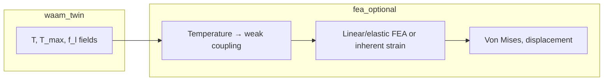

# WAAM Twin — Diagnostics, Viewer & VTK Research Export Spec

**Status:** Draft v1.0  
**Audience:** Research users, ParaView/PyVista workflows, future viewer/IO implementers  
**Scope:** Live GGUI diagnostics + offline export for melt-pool CFD/thermal research  

This document specifies (1) the four-layer WAAM diagnostic stack the project should grow into, and (2) everything that can be exported from the GPU grid today vs. what requires new kernels or storage.

---

## 1. Goals

| Goal | Description |
|------|-------------|
| **See flow** | Velocity vectors, streamlines, vorticity — not only speed-colored voxels |
| **See surface** | Free-surface topography, arc crater, curvature κ |
| **See HAZ** | Peak T, cooling rate, time-at-temperature, probe T(t) |
| **See defects** | Tracer paths, trapped porosity, optional gas-bubble physics |
| **Research IO** | One-command export of all simulation state + metadata for ParaView, Python, Jupyter |
| **Explicit non-goals (v1)** | Solid-mechanics FEA (von Mises, warpage), grain/microstructure prediction |

Residual stress remains a **separate coupled module** (§6), not an extension of LBM VTK.

---

## 2. Current state (baseline)

### 2.1 Live viewer (`python3 -m waam_twin.viewer`)

| Key | Mode | Rendering |
|-----|------|-----------|
| `M` | Temperature / HAZ / Velocity / Vorticity / Body force | Colored **spheres**; body-force mode adds **force arrow** overlay |
| `V` | Flow overlay: off → **velocity arrows** → **streamlines** | Cyan line segments (`scene.lines`, pair layout) |
| `N` | φ surface shell | T-colored interface particles (not triangle mesh) |
| `B` / `H` / `F` | Filters | all / solid / surface |
| `I` | Pick at camera lookat | Adds probe + HUD readout |
| `P` | Probe at torch | Adds probe for T(t) panel + CSV on `G` |
| `G` | VTK bundle | Volume + surface + tracers + meta |

**Implemented (2026-07):** velocity arrows, streamlines, vorticity/body-force views, φ shell with T color, force arrows, lookat pick (`I`), T(t) sparkline HUD, probe CSV via bundle export.

**Still not in GGUI:** true iso-surface triangle mesh, LMB click-pick, ParaView-quality glyphs, tracer trails, crater warp slider, HAZ isotherm legend.

### 2.2 VTK export today (`twin.py`)

| Method | Format | Cell / point data |
|--------|--------|-------------------|
| `export_vtk(path)` | `.vti` ImageData | `Temperature_K`, `Liquid_Fraction`, `T_max_K`, `Velocity_X_ms`, `Velocity_Z_ms` |
| `export_haz_vtk(path)` | `.vti` | `T_max_K`, `T_current_K` |
| `export_surface_vtk(path)` | `.vtp` PolyData | φ or f_l = 0.5 contour; carries interpolated `Temperature_K`, `phi`, `Liquid_Fraction` on mesh |

**Gaps in current export**

- Missing `Velocity_Y_ms` (3D flow is solved; only X/Z written).
- No `origin` / moving-window offset on volume export (surface export sets X origin).
- No JSON sidecar (job, step, material, calibration).
- No tracers, forces, φ, H, flags, cooling rate, material tables.
- No derived κ, ∇T, vorticity, pressure.
- No time-series bundle or XDMF.
- `Fx,Fy,Fz` on grid are **per-step accumulators** cleared at each step start — export mid-frame captures end-of-step values only if called immediately after `step()` and before next `clear_forces`.

### 2.3 Telemetry JSON (`get_telemetry()`)

Scalar summary per call: step, sim time, pool W/D, peak T, peak cooling rate, Marangoni u_max, porosity %, material name/status, window offset.  
**Not** a spatial field; useful as sidecar metadata.

---

## 3. Four-layer diagnostic stack (product spec)

### Layer A — Free-surface topography (arc pressure & droplet impact)

**Physics (existing)**

- VOF `φ`, CSF with κ computed inside `compute_csf_tension` (not stored).
- `apply_arc_pressure`, `apply_vapor_recoil` → `Fz` on interface cells.
- Droplet schedule: pressure spike + `feed_wire` + `feed_wire_momentum` + tracer inject.

**Physics (gaps)**

- κ not persisted; depression depth not a dedicated scalar.
- No explicit shockwave PDE for droplet impact (impulse via pressure bump only).
- PLIC refinement deferred.

**Viewer — Phase A1 (near-term)**

| ID | Feature | Acceptance |
|----|---------|------------|
| A1.1 | Live φ=0.5 **mesh** in GGUI (optional toggle `N`) | Smooth surface replaces particle shell in surface mode |
| A1.2 | Color mesh by `T` or **κ** | Toggle in HUD |
| A1.3 | Exaggerated normal displacement (crater view) | Slider `warp_scale` 1×–50× for visualization only |

**Export — Phase A2**

| ID | Feature | Acceptance |
|----|---------|------------|
| A2.1 | `kappa_field` on volume + interpolated on surface VTK | Matches sign convention in `compute_csf_tension` |
| A2.2 | `grad_phi` / surface normal on `.vtp` | ParaView “Surface Normals” + curvature filter |
| A2.3 | `depression_mm` = reference plane Z − surface Z | Per-arc cross-section CSV |

---

### Layer B — Solid-state thermal history (HAZ)

**Physics (existing)**

- `T_max[i,j,k]` peak tracker.
- `dT_dt` cooling rate (K/s).
- Solid conduction via enthalpy advection–diffusion; remelt (`remelt_hot_solid`).
- Multi-bead / two-layer / interpass validation tests.

**Physics (gaps)**

- No **time-at-temperature** (e.g. ∫dt for T > 800 °C).
- No per-cell **thermal cycle count**.
- No microstructure model.

**Viewer — Phase B1**

| ID | Feature | Acceptance |
|----|---------|------------|
| B1.1 | HAZ mode: isotherm legend (T_solidus, 800 °C, 1100 °C) | HUD + color map |
| B1.2 | Cross-section clip + **solid-only** filter | Key `H` |
| B1.3 | Click probe (LMB on cell) → popup **T, T_max, dT/dt, f_l** | Screen-space pick via nearest particle |

**Export — Phase B2**

| ID | Feature | Acceptance |
|----|---------|------------|
| B2.1 | Export `Cooling_Rate_Ks`, `Enthalpy_Jm3`, `T_prev_K` | On full `.vti` |
| B2.2 | `Time_above_T_K` fields for configurable thresholds (800, 1100, T_solidus) | Updated each step; exported |
| B2.3 | **Probe recorder**: YAML list of (i,j,k) or (x,y,z) mm → `probes.csv` columns `t_ms,T_K,f_l` | Append per export or continuous |
| B2.4 | `export_haz_vtk` merged into full export bundle | Single entry point |

---

### Layer C — Flow & forces (FluidX3D-class visibility)

**Physics (existing)**

- D3Q19 LBM: `ux, uy, uz`, `rho`, body forces `Fx,Fy,Fz` (Marangoni, buoyancy, arc, CSF).
- Carman–Kozeny mushy drag via `f_l` and `C_darcy`.

**Viewer — Phase C1**

| ID | Feature | Acceptance |
|----|---------|------------|
| C1.1 | **Velocity arrows** on liquid cells (subsample stride) | Key `V` cycles off / arrows / streamlines |
| C1.2 | Speed-colored **streamlines** seeded at torch | 20–50 lines, Taichi GGUI lines or instanced cones |
| C1.3 | View mode **Body force** | Color \|F\| or Fz only |
| C1.4 | Vorticity ω magnitude view (derived each frame) | Optional 4th `M` mode |

**Export — Phase C2**

| ID | Feature | Acceptance |
|----|---------|------------|
| C2.1 | Full velocity vector `Velocity_ms` (3 components) | `.vti` cell data |
| C2.2 | `BodyForce_ms2` or lattice `Fx,Fy,Fz` + conversion metadata | Document lu → SI in sidecar |
| C2.3 | Derived: `Speed_ms`, `Vorticity_1_s`, `Pressure_Pa` (ρ cs²) | Computed in export kernel |
| C2.4 | `grad_T` magnitude for Marangoni diagnostics | 3-component vector + scalar |

---

### Layer D — Porosity / entrapped gas

**Physics (existing)**

- Ring-buffer tracers; advect with `ux,uy,uz`; trap when `f_l < 0.05` or solid.
- `porosity_pct`, `n_trapped_tracers` in telemetry.

**Physics (gaps)**

- No shielding-gas bubble phase; no buoyant gas density.
- Tracers ≠ streamlines; no path history stored.

**Viewer — Phase D1**

| ID | Feature | Acceptance |
|----|---------|------------|
| D1.1 | Tracer **trails** (last N positions) | Faint polyline |
| D1.2 | Trapped tracers highlighted (red) | `active==2` |

**Export — Phase D2**

| ID | Feature | Acceptance |
|----|---------|------------|
| D2.1 | `export_tracers_vtp(path)` | Points + `state` (active/trapped), `time_injected_ms` |
| D2.2 | Optional `export_path_vtp` if path history enabled | Variable-length polylines |

---

## 4. VTK & research export — full field inventory

### 4.1 GPU resident fields (`WAAMGrid`)

All are **exportable in principle**. Priority tiers for `export_vtk_full()`:

#### Tier 0 — Always export (core research set)

| Field | VTK name | Units | Notes |
|-------|----------|-------|-------|
| `T` | `Temperature_K` | K | Also `Temperature_C` derived |
| `T_max` | `T_max_K` | K | HAZ envelope |
| `T_prev` | `T_prev_K` | K | For ΔT verification |
| `dT_dt` | `Cooling_Rate_Ks` | K/s | |
| `H` | `Enthalpy_Jm3` | J/m³ | |
| `f_l` | `Liquid_Fraction` | – | |
| `phi` | `VOF_phi` | – | 0 gas … 1 metal |
| `flags` | `Cell_Flags` | – | 0 fluid, 1 solid, 2 gas, 4 iface |
| `ux,uy,uz` | `Velocity_ms` | m/s | **3 components**; `v = u * dx / dt` |
| `rho` | `Density_lu` | lu | Optional `Pressure_Pa` derived |

#### Tier 1 — Process & material (when tables enabled)

| Field | VTK name | Units |
|-------|----------|-------|
| `cp_rho_field` | `RhoCp_Jm3K` | J/(m³·K) |
| `alpha_lu_field` | `Alpha_lu` | lu (sidecar gives SI) |
| `dgamma_lu_field` | `DgammaDT_lu` | lu |
| `tau_field` | `Tau_SRT` | – |

#### Tier 2 — Forces (snapshot semantics)

| Field | VTK name | Notes |
|-------|----------|-------|
| `Fx,Fy,Fz` | `BodyForce_lu` | Export **immediately after** `coupled_step` before next clear; or add `Fx_snap` fields filled at end of step |

#### Tier 3 — Derived at export (no extra GPU storage)

Compute in Taichi/NumPy during export:

| Derived | VTK name | Formula / source |
|---------|----------|------------------|
| Speed | `Speed_ms` | \|u\| |
| Vorticity | `Vorticity_1_s` | ∇×u (central differences) |
| Divergence | `Divergence_1_s` | ∇·u |
| grad T | `Grad_T_Km` | 3-vector |
| \|grad T\| | `GradT_mag_Km` | Marangoni driver |
| Curvature | `Curvature_kappa` | Same as CSF kernel |
| grad φ | `Grad_phi` | Surface normal direction |
| Interface mask | `Is_Interface` | \|∇φ\| > ε |
| Mushy zone | `Mushy_Zone` | 0 < f_l < 1 |

#### Tier 4 — Heavy / debug (off by default)

| Field | VTK name | Size impact |
|-------|----------|-------------|
| `f_a` or `f_b` | `f_0` … `f_18` | **19×** storage — only for LBM debugging |
| Full distribution moments | — | Rarely needed |

#### Tier 5 — Not on grid (separate files)

| Data | Format | Notes |
|------|--------|-------|
| Tracers | `.vtp` PolyData | `porosity_pos`, `porosity_active` |
| Telemetry | `.json` | `get_telemetry()` |
| Job + calibration | `.json` sidecar | Copy of resolved job YAML + material constants |
| Probe time series | `.csv` | Phase B2.3 |
| Torch path | `.csv` | From `torch_path` driver |

### 4.2 Proposed unified API

```python
twin.export_research_bundle(
    out_dir: str | Path,
    tag: str | None = None,          # default: f"step_{step:06d}"
    tiers: tuple[int, ...] = (0, 1, 3),
    include_surface: bool = True,
    include_tracers: bool = True,
    include_sidecar: bool = True,
    crop_liquid: bool = False,       # optional ImageData crop to liquid bbox
)
```

**Bundle layout**

```
viewer_output/
  run_20250630_143022/
    meta.json                 # job, preset, step, sim_time_ms, dx_mm, dt_s, origin_mm, material
    volume_step_004520.vti    # Tier 0+1+3 cell data
    surface_step_004520.vtp   # Contour + kappa, normals
    tracers_step_004520.vtp   # Point cloud
    telemetry_step_004520.json
    probes.csv                # append mode if probes configured
```

### 4.3 JSON sidecar (`meta.json`) — recommended contents

```json
{
  "waam_twin_version": "2.0.0",
  "step": 4520,
  "sim_time_ms": 145.88,
  "grid": { "nx": 266, "ny": 88, "nz": 24, "dx_mm": 0.3, "dt_us": 1.73 },
  "origin_mm": [12.5, 0.0, 0.0],
  "window_offset_x_mm": 12.5,
  "job_path": "jobs/examples/bead_on_plate.yaml",
  "preset": "standard",
  "material": { "name": "ER70S-6", "status": "calibrated", "T_solidus_K": 1720, "T_liquidus_K": 1790 },
  "process": { "current_A": 140, "voltage_V": 20, "travel_speed_mm_s": 8, "arc_efficiency": 0.8 },
  "physics_flags": {
    "enable_vof": true,
    "enable_csf_tension": false,
    "enable_recoil": false,
    "enable_substrate_growth": true,
    "C_darcy": 160000
  },
  "unit_conversions": {
    "velocity_lu_to_ms": "u_ms = u_lu * dx / dt",
    "force_lu_to_ms2": "a_ms2 = F_lu * dx / dt^2"
  },
  "telemetry": { }
}
```

### 4.4 Time series

| Mode | Mechanism | Use case |
|------|-----------|----------|
| **Snapshot** | Press `V` or call `export_research_bundle` | Single-time ParaView |
| **Sequence** | Batch runner: every N steps → bundle subfolder | Animation, T(t) at probe |
| **XDMF** | PyVista `save` + XDMF wrapper over `volume_*.vti` | ParaView time slider |
| **PVD** | ParaView collection file listing timesteps | Standard CFD post |

Spec requirement: `export_research_sequence(out_dir, every_n_steps, max_frames)` for unattended runs.

### 4.5 File size guidance

For `nx×ny×nz` = 266×88×24 ≈ 561k cells:

| Content | Approx size |
|---------|-------------|
| Tier 0 scalars (~10 fields) | ~22 MB per snapshot |
| Tier 0 + vectors (u, gradT) | ~35 MB |
| Tier 3 derived (+5 fields) | +11 MB |
| Tier 4 (19 distributions) | ~400 MB — avoid |
| Surface `.vtp` | 1–5 MB |
| Tracers (20k points) | < 1 MB |

Use `crop_liquid=True` or masked export to cut volume ~10× for pool-focused studies.

### 4.6 ParaView quick recipes

| Research question | Pipeline |
|-------------------|----------|
| Marangoni flow | `Glyph` on `Velocity_ms`, `Stream Tracer` seeded line above pool |
| Arc crater | `Warp By Vector` on surface using normals × `depression_mm` |
| HAZ isotherms | `Contour` on `T_max_K` at 800, 1100, T_solidus |
| Cooling rate | `Clip` + color `Cooling_Rate_Ks` |
| Porosity | Load `tracers.vtp`, threshold `state==2` |
| κ / spatter risk | Color surface by `Curvature_kappa` |

---

## 5. Viewer UX spec (summary)

### New controls (proposed)

| Key | Action |
|-----|--------|
| `M` | Cycle T → HAZ → Velocity → Vorticity → Body force |
| `V` | Cycle flow viz: off → arrows → streamlines |
| `N` | Toggle surface mesh vs particles |
| `G` | Export **full** research bundle (not minimal VTK) |
| `P` | Place probe at torch / pick cell |

CLI flags:

```bash
--export-tier 0,1,3
--probe jobs/examples/probes_bead.yaml
--streamline-seeds 32
```

### HUD additions

- Active export tier, last bundle path  
- Probe readout when `P` active  
- κ_max and depression depth at torch  

---

## 6. Layer E — Residual stress & warpage (out of LBM VTK)

**Not stored in current grid.** Recommended architecture:



| ID | Feature | Notes |
|----|---------|-------|
| E1 | Export **temperature history** on solid domain for FEA | VTK or Exodus |
| E2 | Inherent-strain stub from ΔT and solidification | Simplified WAAM distortion |
| E3 | Import FEA mesh displacement → viewer warp | 10×–50× exaggeration |

Deliverable: separate `docs/THERMOMECHANICAL_COUPLING_SPEC.md` when scoped.

---

## 7. Implementation phases & priorities

| Phase | Scope | Est. effort | Depends on |
|-------|--------|-------------|------------|
| **P0** | `export_vtk_full` Tier 0+3, JSON sidecar, fix `Velocity_Y`, volume `origin` | 1–2 days | — |
| **P1** | `export_research_bundle`, tracer VTP, viewer `G` key | 2–3 days | P0 |
| **P2** | κ field kernel + surface export; viewer surface mesh | 3–5 days | P0 |
| **P3** | Viewer arrows + streamlines | 3–5 days | — |
| **P4** | Probe CSV + time-at-T fields | 5–7 days | P0 |
| **P5** | XDMF/PVD time series in batch runner | 2–3 days | P1 |
| **P6** | Thermomechanical coupling spec + prototype | separate track | P4 |

**Recommended order for research impact:** P0 → P1 → P2 → P3 → P4 → P5.

---

## 8. Acceptance tests

| Test | File | Pass criterion |
|------|------|----------------|
| Full volume export round-trip | `test_export_full_vtk.py` | PyVista loads; ≥15 array names; u_y present |
| Sidecar schema | `test_export_meta_json.py` | Required keys; dx/dt match grid |
| κ vs Laplace | extend `test_laplace.py` | Exported κ sign consistent |
| Bundle layout | `test_export_bundle.py` | All files present; non-zero surface |
| Tracer export | `test_export_tracers.py` | trapped count == telemetry |
| Probe CSV | `test_probe_recorder.py` | Monotonic t; T finite |

---

## 9. Related files

| Path | Role |
|------|------|
| `twin.py` | `export_vtk`, `export_haz_vtk`, `export_surface_vtk` |
| `grid.py` | Field definitions |
| `kernels.py` | CSF κ, Marangoni, tracers |
| `viewer/extract.py` | Live extraction kernels |
| `validation/telemetry_schema.json` | Scalar telemetry contract |

---

## 10. Changelog

| Version | Date | Notes |
|---------|------|-------|
| 1.0 | 2026-06-30 | Initial spec: four diagnostic layers + VTK tier inventory |
| 1.1 | 2026-06-30 | **Implemented:** P0–P5 (`waam_twin/export/`, viewer M/V/G/P/N/H, probes, time-at-T) |
