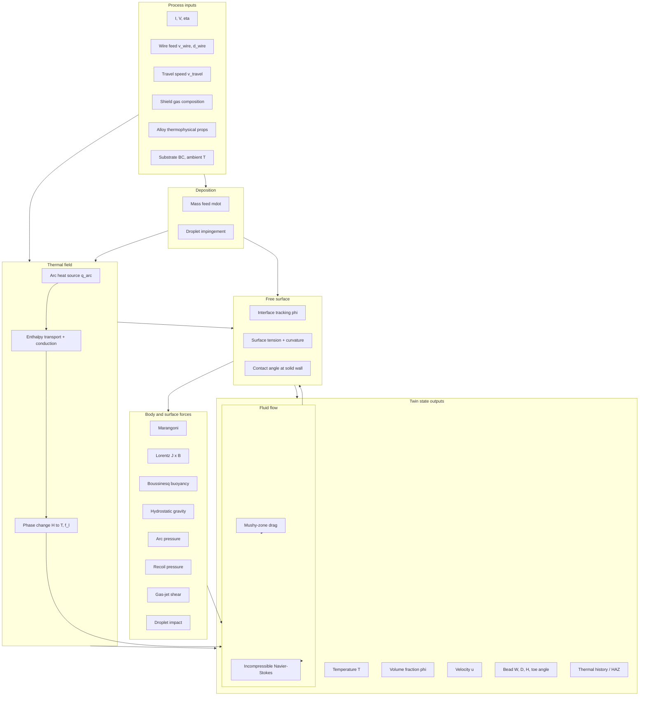

# WAAM Weld Pool Physics Centre

**Status:** Living reference — Physics Centre (Frame B)  
**Scope:** Literature-based physics of wire-arc melt pools for WAAM / GMAW digital twins  
**Audience:** Thesis, FigJam Physics Centre, validation design, examiner review  
**Explicit non-scope:** Software implementation, repository modules, solver presets, or code traceability

This document defines **what the numerical twin must represent physically** — governing equations, constitutive laws, boundary conditions, force catalogue, metal-transfer physics, and literature provenance. It is anchored in weld-pool CFD and GMA-AM literature (Oreper & Szekely, Kou, Goldak, Voller & Prakash, Wang et al., Aryal 2023, Mills et al., Matsunawa & Semak, Lin & Eagar, and related sources in the project literature folder).

---

## Table of contents

1. [Purpose and reading guide](#1-purpose-and-reading-guide)  
2. [Process context: GMAW and WAAM](#2-process-context-gmaw-and-waam)  
3. [Physics coupling overview](#3-physics-coupling-overview)  
4. [Process inputs and global energy balance](#4-process-inputs-and-global-energy-balance)  
5. [Governing conservation equations](#5-governing-conservation-equations)  
6. [Heat sources and thermal boundary conditions](#6-heat-sources-and-thermal-boundary-conditions)  
7. [Phase change, solidification, and mushy-zone mechanics](#7-phase-change-solidification-and-mushy-zone-mechanics)  
8. [Free-surface topology and capillary physics](#8-free-surface-topology-and-capillary-physics)  
9. [Force catalogue (complete)](#9-force-catalogue-complete)  
10. [Metal transfer and droplet impingement (GMAW-specific)](#10-metal-transfer-and-droplet-impingement-gmaw-specific)  
11. [Wire feed, stick-out, and CTWD coupling](#11-wire-feed-stick-out-and-ctwd-coupling)  
12. [Shielding gas, arc plasma, and aerodynamic effects](#12-shielding-gas-arc-plasma-and-aerodynamic-effects)  
13. [Material properties and constitutive relations](#13-material-properties-and-constitutive-relations)  
14. [Bead geometry, pool metrics, and validation quantities](#14-bead-geometry-pool-metrics-and-validation-quantities)  
15. [Dimensionless groups and force dominance](#15-dimensionless-groups-and-force-dominance)  
16. [Conceptual operator coupling (one weld timestep)](#16-conceptual-operator-coupling-one-weld-timestep)  
17. [Model tiers: what to include when](#17-model-tiers-what-to-include-when)  
18. [Master reference list](#18-master-reference-list)

---

## 1. Purpose and reading guide

### 1.1 What this document is

The **Physics Centre** is the authoritative description of melt-pool physics for the WAAM digital twin objective map. It answers:

- Which PDEs govern temperature, flow, and interface motion?  
- Which body forces and surface tractions act on the pool?  
- Which process inputs enter the model boundary?  
- Which outputs define bead geometry and thermal history?  
- Which published works justify each term?

### 1.2 What this document is not

- Not a software design document  
- Not a validation report for any particular codebase  
- Not a substitute for full arc-plasma or microstructure models  

Implementation choices (FVM, LBM, FEM, VOF, level-set, etc.) are **numerical methods** layered on top of this physics specification.

### 1.3 Relationship to other artefacts

| Artefact | Role |
|----------|------|
| Miro / `WAAM Architecture.pdf` | Physical cell hardware |
| FigJam platform map | How hardware, DAQ, twin, controller connect |
| **This Physics Centre** | What the twin computes |
| `WAAM_FORMULAE.tex` | LaTeX equation sheet (may be synced later; implementation cites to be removed from objective use) |

---

## 2. Process context: GMAW and WAAM

### 2.1 GMAW (Gas Metal Arc Welding)

In **GMAW**, an consumable wire electrode is fed through a torch. An electric arc between wire tip and workpiece melts both wire and substrate. Molten metal transfers across the arc gap, impinges the melt pool, and solidifies into a bead. Shielding gas protects the pool from oxidation.

**Dominant physical phenomena** (Aryal 2023; Kou 2003; Lancaster 1986):

- Joule heating in arc and wire (`I`, `V`, efficiency `η`)  
- Moving heat source tied to torch travel speed  
- Electromagnetic (Lorentz) body forces in the pool  
- Thermocapillary (Marangoni) surface shear  
- Buoyancy and hydrostatic gravity  
- Free-surface deformation (arc pressure, recoil, droplet impact)  
- Periodic metal transfer (droplet mass, momentum, enthalpy)  
- Solidification and mushy-zone resistance  

### 2.2 WAAM (Wire Arc Additive Manufacturing)

WAAM is **GMAW used layer-by-layer** to build 3-D geometry. Additional concerns beyond single-bead welding:

- **Multi-layer thermal accumulation** and interpass cooling (Love et al. 2025; General_WAAM metrology review)  
- **Bead-on-bead wetting** and toe-angle control at substrate and previously solidified layers  
- **CTWD drift** as layer height grows (stick-out resistance, wire preheat)  
- **Path-dependent thermal history** (HAZ, remelt, porosity risk)  

The melt-pool physics centre still describes **local pool-scale** physics; part-scale distortion and residual stress require separate thermomechanical FEA (Radaj 2003; Love et al. 2025).

### 2.3 Autogenous vs wire-fed

| Mode | Feed | Key extra physics |
|------|------|-------------------|
| GTAW (autogenous) | None | Marangoni, Lorentz, buoyancy, recoil (high power) |
| GMAW / WAAM | Wire + droplets | All GTAW terms **plus** mass/momentum/enthalpy injection, transfer-mode dynamics (Wang et al. 2003; Lancaster 1986) |

---

## 3. Physics coupling overview

**Reading the diagram:** Temperature drives Marangoni, buoyancy, and material properties. The free surface mediates arc pressure, recoil, gas shear, and droplet impact. Deposition adds mass and enthalpy at the interface. Solidification feedback locks geometry through mushy-zone mechanics.

---

## 4. Process inputs and global energy balance

### 4.1 Electrical power and effective arc heat

Arc electrical power:

\[
P = IV
\]

Effective heat input to the workpiece (after radiation, convection in arc column, and losses to electrode):

\[
Q_{\mathrm{eff}} = \eta IV
\]

where \(I\) [A] is arc current, \(V\) [V] arc voltage, \(\eta\) arc thermal efficiency (material- and process-dependent, often 0.6–0.85 for GMAW steel).

**References:** Kou (2003); Incropera et al. (2007); Radaj (2003); Lancaster (1986).

### 4.2 Line energy (travel-speed scaling)

Heat input per unit weld length:

\[
q_{\mathrm{line}} = \frac{Q_{\mathrm{eff}}}{v_{\mathrm{travel}}}
\]

High travel speed → lower line energy → narrower/shallower pool (Rosenthal scaling).

**References:** Rosenthal (1946); Goldak et al. (1984); Kou (2003).

### 4.3 Wire mass feed rate

Wire cross-section \(A_w = \pi d_w^2/4\):

\[
\dot{m} = \rho A_w v_{\mathrm{wire}}
= \rho \frac{\pi d_w^2}{4} v_{\mathrm{wire}}
\]

**References:** Wang et al. (2003); Lancaster (1986); Bernhardi & Duffie (2005).

### 4.4 Droplet mass and transfer frequency

For transfer frequency \(f_{\mathrm{drop}}\) [Hz] and interval \(\Delta t_{\mathrm{drop}} = 1/f_{\mathrm{drop}}\):

\[
m_{\mathrm{drop}} = \dot{m}\,\Delta t_{\mathrm{drop}}, \qquad
V_{\mathrm{drop}} = \frac{m_{\mathrm{drop}}}{\rho}
\]

**References:** Wang et al. (2003); Lancaster (1986).

### 4.5 Mass–energy consistency (design constraint)

Over time \(t\), expected deposited mass:

\[
m_{\mathrm{dep,expected}} = \dot{m}\, t
\]

A physics-faithful twin should conserve deposited mass to order unity when comparing integrated feed to integrated solidified bead volume (Bernhardi & Duffie 2005; Wang et al. 2003).

---

## 5. Governing conservation equations

### 5.1 Continuity (mass conservation)

\[
\frac{\partial \rho}{\partial t} + \nabla\cdot(\rho\mathbf{u}) = 0
\]

In the incompressible liquid-metal region, \(\rho \approx \rho_0\) and \(\nabla\cdot\mathbf{u} = 0\).

**References:** Batchelor (1967); Patankar (1980).

### 5.2 Momentum (Navier–Stokes)

\[
\rho\left(\frac{\partial \mathbf{u}}{\partial t} + \mathbf{u}\cdot\nabla\mathbf{u}\right)
= -\nabla p + \nabla\cdot\left[\mu\left(\nabla\mathbf{u} + \nabla\mathbf{u}^{\mathsf T}\right)\right]
+ \rho\mathbf{g} + \mathbf{F}_{\mathrm{body}}
\]

where \(\mathbf{F}_{\mathrm{body}}\) collects Lorentz force, Boussinesq buoyancy (often split from \(\rho\mathbf{g}\)), mushy-zone drag, and any volumetric representations of surface forces in diffuse-interface formulations.

**References:** Oreper & Szekely (1984); Kou (2003); Batchelor (1967).

### 5.3 Energy — enthalpy formulation (recommended for phase change)

Primary conserved variable: volumetric enthalpy \(H\) [J/m³]:

\[
\frac{\partial H}{\partial t} + \mathbf{u}\cdot\nabla H = \nabla\cdot(k\nabla T) + \dot{q}_{\mathrm{arc}} + \dot{q}_{\mathrm{dep}}
\]

with \(k = \rho c_p \alpha\), and \(\dot{q}_{\mathrm{dep}}\) enthalpy source from wire/droplet addition.

Temperature \(T\) is recovered from \(H\) via phase-change relations (Section 7).

**References:** Voller & Prakash (1987); Brent et al. (1988); Incropera et al. (2007).

### 5.4 Alternative energy form (temperature-based)

\[
\rho c_p\left(\frac{\partial T}{\partial t} + \mathbf{u}\cdot\nabla T\right)
= \nabla\cdot(k\nabla T) + \dot{q}_{\mathrm{latent}} + \dot{q}_{\mathrm{arc}}
\]

Enthalpy–porosity methods embed latent heat in \(H\) instead of explicit \(\dot{q}_{\mathrm{latent}}\) (Voller & Prakash 1987).

### 5.5 Volume-of-fluid (interface advection)

Volume fraction of liquid metal \(\phi \in [0,1]\):

\[
\frac{\partial \phi}{\partial t} + \mathbf{u}\cdot\nabla \phi = 0
\]

Gas is \(\phi \to 0\); bulk liquid metal \(\phi \to 1\). Interface where \(|\nabla\phi|\) is large.

**References:** Hirt & Nichols (1981); Rider & Kothe (1998); Aryal (2023).

---

## 6. Heat sources and thermal boundary conditions

### 6.1 Rosenthal moving point source (analytical baseline)

For a point heat source moving at speed \(v\) on a semi-infinite body (far-field trailing edge, \(x < 0\) in co-moving frame):

\[
\sigma_R = \frac{\rho c_p v}{2k}, \qquad
T - T_0 = \frac{\eta Q}{2\pi k}\,\frac{1}{|x|}\,\exp(\sigma_R x)
\]

Used for **sanity checks**, not full pool shape (neglects convection, phase change, free surface).

**References:** Rosenthal (1946); Carslaw & Jaeger (1959).

### 6.2 Gaussian surface flux (2D disc)

\[
q(r) = \frac{Q\eta}{2\pi\sigma^2}\,\exp\!\left(-\frac{r^2}{2\sigma^2}\right)
\]

where \(r\) is radial distance from arc centre on the pool surface. Widely used for GMAW/GTAW when calibrated to experiments (Pavelic et al. — cited in Aryal 2023 state-of-art; Friedman FEM coupling).

**References:** Rykalin (1951); Goldak et al. (1984) [disc variant]; Aryal (2023).

### 6.3 Goldak double-ellipsoid volumetric source

Classical 3-D form (front/rear ellipsoids with partition fractions \(f_f + f_r = 1\)):

\[
q(\xi,y,z) = \frac{6\sqrt{3}\,f\,Q}{\pi\sqrt{\pi}\,a\,b\,c}
\exp\!\left(-\frac{3\xi^2}{a^2} - \frac{3y^2}{b^2} - \frac{3z^2}{c^2}\right)
\]

Captures **depth penetration** beyond a pure surface disc. Standard in welding FEA when pool convection is neglected (Love et al. 2025; MAPDL Goldak parameters in project ANSYS notes).

**References:** Goldak et al. (1984); Goldak & Akhlaghi (1984); Kazemi & Goldak (2009).

### 6.4 Penetration attenuation below surface

Volumetric deposition of arc energy often uses exponential attenuation with depth \(z\):

\[
w_{\mathrm{dep}}(z) = \exp\!\left(-\frac{\max(0,\, z_{\mathrm{arc}} - z)}{\delta}\right)
\]

**References:** Goldak et al. (1984); Rosenthal (1946).

### 6.5 Boundary heat losses

On gas-exposed surfaces:

\[
q_{\mathrm{loss}} = h_{\mathrm{conv}}(T - T_{\mathrm{amb}})
+ \varepsilon\sigma_{\mathrm{SB}}(T^4 - T_{\mathrm{amb}}^4)
\]

**References:** Incropera et al. (2007); Kou (2003).

### 6.6 Substrate and far-field boundaries

- **Substrate bottom/sides:** fixed temperature or convective BC  
- **Symmetry plane** (if used): zero normal heat flux, zero normal velocity, zero shear on symmetry normal  
- **Solid–liquid interface:** no-slip for flow; continuity of heat flux  

**References:** Kou (2003); Oreper & Szekely (1984); FEM weld-pool lecture tradition (DebRoy/Kou lineage).

---

## 7. Phase change, solidification, and mushy-zone mechanics

### 7.1 Enthalpy–porosity method (Voller & Prakash)

Define:

\[
H_s = \rho c_p T_s, \qquad H_l = H_s + \rho L_f
\]

**Solid** (\(H \le H_s\)): \(f_l = 0\), \(T = H/(\rho c_p)\)

**Mushy** (\(H_s < H < H_l\)):

\[
f_l = \frac{H - H_s}{\rho L_f}, \qquad
T = T_s + f_l(T_l - T_s)
\]

**Liquid** (\(H \ge H_l\)): \(f_l = 1\), \(T = T_l + (H - H_l)/(\rho c_p)\)

**References:** Voller & Prakash (1987); Brent et al. (1988); Aryal (2023).

### 7.2 Mushy-zone permeability (Carman–Kozeny drag)

Semi-implicit damping of velocity in mush:

\[
\mathbf{u}_{\mathrm{eff}} = \frac{\mathbf{u}}{1 + C_K \dfrac{(1-f_l)^2}{f_l^3 + \varepsilon}}
\]

Models high resistance to flow in partially solidified regions. Prevents advection in solid while allowing smooth transition.

**References:** Voller & Prakash (1987); Poirier (1987); Aryal (2023).

### 7.3 Stefan problem (validation benchmark)

Stefan number:

\[
\mathrm{Ste} = \frac{c_p(T_{\mathrm{init}} - T_0)}{L_f}
\]

Interface position \(s(t) = 2\lambda\sqrt{\alpha t}\) from classical Stefan solution — used to verify latent-heat coupling independent of arc physics.

**References:** Carslaw & Jaeger (1959); Crank (1984).

### 7.4 Vaporization ceiling (optional high-T cap)

Cap enthalpy at boiling/vaporization limit to avoid non-physical superheating when recoil/keyhole models are not active:

\[
H \le H_{\mathrm{vap}} = \rho c_p T_{\mathrm{vap,cap}} + \rho L_{\mathrm{vap}}
\]

**References:** Matsunawa & Semak (1997); Semak & Matsunawa (1997).

### 7.5 Solidification–bead locking (physical role)

When \(f_l \to 0\), flow ceases and the free surface becomes part of the solid boundary for subsequent timesteps. This **locks** lateral spread and crown height — critical for WAAM layer height stability (Heiple & Roper 1982; multi-layer reviews in Love et al. 2025).

---

## 8. Free-surface topology and capillary physics

### 8.1 Continuum Surface Force (CSF) method

Interface unit normal and curvature:

\[
\hat{\mathbf{n}} = \frac{\nabla\phi}{|\nabla\phi|}, \qquad
\kappa = -\nabla\cdot\hat{\mathbf{n}}
\]

Surface tension force density:

\[
\mathbf{F}_{\mathrm{CSF}} = \gamma\,\kappa\,\nabla\phi
\]

**References:** Brackbill et al. (1992); Aryal (2023).

### 8.2 Marangoni as surface shear (FEM boundary form)

Thermocapillary shear stress on the free surface:

\[
\tau_M = \frac{\mathrm{d}\gamma}{\mathrm{d}T}\,\nabla_s T
\]

where \(\nabla_s T = (\mathbf{I} - \hat{\mathbf{n}}\hat{\mathbf{n}}^{\mathsf T})\nabla T\) is surface gradient.

**References:** Davis (1987); Kou (2003); Oreper & Szekely (1984); Mills et al. (1998).

### 8.3 Young's law and wetting at solid walls

\[
\cos\theta = \frac{\gamma_{sv} - \gamma_{sl}}{\gamma_{lv}}
\]

Contact angle \(\theta\) at the solid–liquid–gas triple line controls toe angle and lateral spread on substrate and previously deposited bead metal.

**References:** de Gennes et al. (2004); Brackbill et al. (1992); Ding & Spelt (2008).

### 8.4 Capillary length and Bond number

Capillary length:

\[
\lambda_c = \sqrt{\frac{\gamma}{\rho g}}
\]

Bond number:

\[
\mathrm{Bo} = \frac{\rho g L^2}{\gamma}
\]

For steel-scale pool width \(L \sim 5\,\mathrm{mm}\), \(\mathrm{Bo} \sim \mathcal{O}(0.1)\): surface tension dominates crest shape but gravity still matters for horizontal plate crown height.

**References:** Batchelor (1967); de Gennes et al. (2004).

### 8.5 Interface capturing vs tracking (method context)

Modern weld-pool CFD uses **VOF** or **level-set** on fixed grids because droplet coalescence, breakup, and large deformation break Lagrangian interface-fitting (Aryal 2023, Ch. 4; Cao et al. droplet impact lineage).

**References:** Hirt & Nichols (1981); Aryal (2023); Cao et al. (cited in Aryal 2023 state-of-art).

---

## 9. Force catalogue (complete)

This section is the core of the Physics Centre. Each force includes: **physical origin**, **mathematical form**, **typical effect on pool shape**, **dominance regime**, and **references**.

### 9.1 Marangoni (thermocapillary) force

| Item | Detail |
|------|--------|
| **Origin** | Temperature-dependent surface tension \(\gamma(T)\) |
| **Pure metals** | \(\mathrm{d}\gamma/\mathrm{d}T < 0\) → outward surface flow from hot centre to cold periphery → **wide, shallow** pool |
| **Active elements (S, O)** | Can flip \(\mathrm{d}\gamma/\mathrm{d}T > 0\) locally → **inward/downward** flow → narrow, deep penetration (Heiple & Roper 1982; Mills et al. 1998). Simulator: `surfactant.model: sahoo` installs Sahoo/DebRoy \(\gamma(T,a_S)\) tables — see `PHYSICS_FORCE_CORRECTNESS_SPEC.md` §5.9. |
| **Form (CSF/volume)** | \(\mathbf{F}_M = \dfrac{\mathrm{d}\gamma}{\mathrm{d}T}\,\nabla_s T\,|\nabla\phi|\) |
| **Dominance** | Often **leading-order** in GTAW/GMAW conduction-mode pools (Oreper & Szekely 1984; Kou & Sun 1985) |

**Marangoni number:**

\[
\mathrm{Ma} = \frac{|\mathrm{d}\gamma/\mathrm{d}T|\,|\Delta T|\,L}{\mu\alpha}
\]

**References:** Kou (2003); Davis (1987); Oreper & Szekely (1984); Mills et al. (1998); Heiple & Roper (1982); Burgardt & Heiple (1986); Havrylov (thesis, Marangoni scaling).

---

### 9.2 Lorentz (electromagnetic) force

| Item | Detail |
|------|--------|
| **Origin** | Arc current density \(\mathbf{J}\) and induced magnetic field \(\mathbf{B}\) |
| **Form** | \(\mathbf{F}_{\mathrm{em}} = \mathbf{J} \times \mathbf{B}\) |
| **Effect** | Inward and **downward** pumping in pool centre; scales strongly with current (\(I^2\) in simplified models) |
| **Dominance** | Competes with Marangoni at high current; critical for penetration depth |

**Governing EM sub-problem (full model):**

\[
\nabla\cdot(\sigma\nabla\phi_e) = 0, \qquad \mathbf{J} = -\sigma\nabla\phi_e
\]

\[
\mathbf{B} = \mu_0 \nabla \times \mathbf{A}, \qquad \nabla^2 \mathbf{A} = -\mu_0 \mathbf{J}
\]

(magnetostatic / quasi-steady approximations common in weld CFD).

**Simplified analytical models:** Kou & Sun (1985); Tsao & Wu; Aryal (2023) compares PDE vs Kou–Sun vs Tsao–Wu EMF variants.

**References:** Oreper & Szekely (1984); Jackson (1999); Kou & Sun (1985); Aryal (2023).

---

### 9.3 Buoyancy (natural convection, Boussinesq)

| Item | Detail |
|------|--------|
| **Origin** | Density variation with temperature |
| **Form** | \(F_z = -\rho g \beta (T - T_{\mathrm{ref}})\,f_l\) |
| **Effect** | Upward plume in hot centre; downward at cold periphery |
| **Dominance** | Usually **secondary** to Marangoni/Lorentz in arc welding; more important in large, slow pools |

**References:** Oreper & Szekely (1984); Kou (2003); Incropera et al. (2007).

---

### 9.4 Hydrostatic gravity (full)

| Item | Detail |
|------|--------|
| **Origin** | Gravitational body force on liquid mass |
| **Form** | \(\mathbf{F}_g = \rho \mathbf{g}\, f_l\) |
| **Effect** | Flattens crown on horizontal builds; sets hydrostatic pressure depth profile |
| **Note** | Distinct from Boussinesq perturbation; both act in horizontal WAAM beads |

**References:** Batchelor (1967); de Gennes et al. (2004).

---

### 9.5 Arc pressure

| Item | Detail |
|------|--------|
| **Origin** | Momentum flux of arc plasma jet on pool surface |
| **Common CFD form** | Normal pressure on free surface: \(p_{\mathrm{arc}}(r) = p_0 \exp(-r^2/2\sigma_{\mathrm{arc,p}}^2)\) |
| **Empirical \(p_0(I)\)** | Lin & Eagar relation (GTA): \(p_{\mathrm{arc}} \approx \dfrac{\mu_0 I^2}{4\pi^2 \sigma_{\mathrm{arc,p}}^2}\exp(-r^2/2\sigma_{\mathrm{arc,p}}^2)\) (Aryal 2023, Eq. 31; Lin & Eagar 1986) |
| **Effect** | Downward surface depression; can enhance penetration **when coupled to free-surface flow** |
| **Scope caution** | Lin & Eagar (1985) static energy-minimization study of pool depression suggests arc pressure alone may be **secondary** to electromagnetic and thermocapillary effects at high GTA current — cite for **interpretation**, not as proof the term is zero |

**References:** Lin & Eagar (1985); Lin & Eagar (1986); Oreper & Szekely (1984); Tanaka & Lowke (2007); Aryal (2023); Mills et al. (1998) [arc pressure mentioned with surface tension].

---

### 9.6 Recoil pressure (vaporization-driven)

| Item | Detail |
|------|--------|
| **Origin** | Momentum of vapor jet leaving high-temperature free surface |
| **Form (Clausius–Clapeyron)** | \(P_{\mathrm{vap}}(T) = P_{\mathrm{ref}}\exp\!\left[\dfrac{L_v}{R_v}\left(\dfrac{1}{T_b} - \dfrac{1}{T}\right)\right]\), \(T > T_b\) |
| **Effect** | Drives **keyhole** formation at high power density; deep narrow cavity |
| **WAAM relevance** | Usually smaller than in laser/keyhole modes unless extreme current/plasma conditions |

**References:** Matsunawa & Semak (1997); Semak & Matsunawa (1997); Aryal (2023.

---

### 9.7 Gas-jet / plasma shear stress

| Item | Detail |
|------|--------|
| **Origin** | Shielding gas and plasma flow over deformed surface |
| **Form** | \(\tau_{\mathrm{gas}} \sim \tfrac{1}{2}\rho_{\mathrm{gas}} v_{\mathrm{jet}}^2 C_\tau\) |
| **Effect** | Tangential surface traction; can affect ripple and surface waves; pulsed-arc vortex formation (Ghosh et al., cited in Aryal 2023) |

**References:** Oreper & Szekely (1984); Mills et al. (1998); Aryal (2023).

---

### 9.8 Surface tension (CSF) — capillary pressure

Isotropic surface tension creates normal stress proportional to curvature (Section 8.1). Works with Marangoni (tangential) to set pool meniscus shape.

**References:** Brackbill et al. (1992); Young/Laplace tradition (de Gennes 2004).

---

### 9.9 Mushy-zone drag (Darcy-type)

Not a separate “force” in nature — **model artefact** representing solid–liquid interaction in porous mush. Essential for stable solidification front.

See Section 7.2.

---

### 9.10 Force interaction summary table

| Force | Type | Primary direction | Scales with | Typical WAAM role |
|-------|------|-------------------|-------------|-------------------|
| Marangoni | Surface | Tangential | \(\|\mathrm{d}\gamma/\mathrm{d}T\|\,\Delta T\) | Pool width, circulation |
| Lorentz | Body | Inward/down | \(I^2\) | Penetration depth |
| Buoyancy | Body | Vertical | \(\beta\,\Delta T\) | Secondary circulation |
| Gravity | Body | Vertical | \(\rho g\) | Crown flattening |
| Arc pressure | Surface normal | Down | \(I^2\) (empirical) | Surface depression |
| Recoil | Surface normal | Down | \(T \nearrow T_b\) | Keyhole (extreme) |
| Gas shear | Surface tangential | Shear | \(v_{\mathrm{jet}}^2\) | Surface rippling |
| Droplet impact | Surface/body | Normal + tangential | \(\dot{m}, v_{\mathrm{drop}}\) | Mixing, crater, porosity |

**References:** Oreper & Szekely (1984); Kou (2003); Aryal (2023); Mills et al. (1998); Figure 4 in Mills et al. (1998) force taxonomy (Marangoni, Lorentz, buoyancy, aerodynamic drag).

---

## 10. Metal transfer and droplet impingement (GMAW-specific)

### 10.1 Transfer modes (Aryal 2023; Lancaster 1986)

| Mode | Current / condition | Character | WAAM suitability |
|------|---------------------|-----------|------------------|
| **Short-circuit** | Low current | Wire touches pool repeatedly | Generally poor (spatter, lack of fusion) |
| **Globular** | Intermediate | Large irregular droplets | Usually avoided |
| **Spray** | High current, Ar-rich gas | Fine droplets, stable arc | **Preferred** for WAAM |

Mode depends on \(I\), \(V\), WFS, wire diameter, shield gas, CTWD (Aryal 2023, §2.2).

### 10.2 Forces governing detachment (Figure 2.3, Aryal 2023)

- Gravity on droplet  
- Electromagnetic pinch (spray/globular)  
- Surface tension at wire tip  
- Aerodynamic drag from gas/plasma  
- Anode/cathode region effects  

**References:** Lancaster (1986); Wang et al. (2003); Aryal (2023).

### 10.3 Droplet impact velocity (order-of-magnitude model)

Characteristic drop length \(L_{\mathrm{drop}} \approx v_{\mathrm{wire}}/f_{\mathrm{drop}}\):

\[
v_{\mathrm{grav}} = \sqrt{2 g L_{\mathrm{drop}}}, \qquad
v_{\mathrm{impact}} \approx \max(v_{\mathrm{wire}},\, v_{\mathrm{grav}} + v_{\mathrm{pinch}})
\]

Transfer-mode scaling factors adjust \(v_{\mathrm{impact}}\) for globular vs spray (Wang et al. 2003).

### 10.4 Droplet kinetic pressure on impact

\[
E_{\mathrm{kin}} = \tfrac{1}{2} m_{\mathrm{drop}} v_{\mathrm{impact}}^2, \qquad
p_{\mathrm{impact}} \approx \frac{E_{\mathrm{kin}}}{\pi r_{\mathrm{contact}}^2}
\]

Can locally crater the free surface and entrain gas (porosity precursor).

**References:** Wang et al. (2003); Bernhardi & Duffie (2005); Cao et al. (VOF droplet impact lineage, Aryal 2023).

### 10.5 Droplet enthalpy injection

\[
H_{\mathrm{drop}} = \rho c_p T_{\mathrm{drop}} + \rho L_f
\]

with superheated drop temperature \(T_{\mathrm{drop}} \approx T_l + \Delta T_{\mathrm{superheat}}\).

**References:** Wang et al. (2003); Voller & Prakash (1987).

### 10.6 Historical modelling progression (context)

1. Tsao & Wu — enthalpy source only, rigid surface  
2. Kim & Na / Ushio & Wu — deforming surface, boundary-fitted  
3. **VOF era (2000s+)** — coalescence, bead build-up geometry (Cao et al.; Aryal 2023)  

**References:** Tsao & Wu (cited Aryal 2023); Kim & Na; Ushio & Wu; Cao et al.; Aryal (2023).

---

## 11. Wire feed, stick-out, and CTWD coupling

### 11.1 Contact tip-to-work distance (CTWD)

CTWD = wire stick-out length between contact tip and workpiece. Affects:

- Resistance preheating of wire  
- Arc length and voltage  
- Droplet formation site  

Layer-to-layer drift:

\[
\mathrm{CTWD}_{n+1} = \mathrm{CTWD}_{\mathrm{nominal}} + (h_{\mathrm{bead,measured}} - h_{\mathrm{layer,planned}})
\]

**References:** Lancaster (1986); short-circuit / resistance literature (Klaus et al. 2022 cited in project bead spec).

### 11.2 Stick-out resistance preheat

\[
R_{\mathrm{stick}} = \frac{\rho_e L_{\mathrm{stick}}}{A_w}, \qquad
P_{\mathrm{preheat}} = \eta_{\mathrm{stick}} I^2 R_{\mathrm{stick}}
\]

Temperature rise of incoming wire:

\[
\Delta T_{\mathrm{preheat}} = \frac{P_{\mathrm{preheat}}}{\dot{m}\, c_p}
\]

**References:** Bernhardi & Duffie (2005); Lancaster (1986).

---

## 12. Shielding gas, arc plasma, and aerodynamic effects

- **Composition (Ar-rich vs CO₂-rich)** shifts transfer mode and surface tension active-element behaviour (Aryal 2023).  
- **Aerodynamic drag** on droplet and pool surface included in force taxonomy (Mills et al. 1998).  
- Full **arc plasma simulation** (Navier–Stokes + radiation in arc column) is a separate high-fidelity tier (Tanaka & Lowke 2007) — usually **not** co-simulated in pool-scale twins; arc effects enter as **boundary fluxes** (\(q_{\mathrm{arc}}\), \(p_{\mathrm{arc}}\), \(\mathbf{J}\) distribution).

**References:** Tanaka & Lowke (2007); Lancaster (1986); Mills et al. (1998); Aryal (2023).

---

## 13. Material properties and constitutive relations

### 13.1 Temperature-dependent properties

| Property | Symbol | Role |
|----------|--------|------|
| Density | \(\rho(T)\) | Mass conservation, buoyancy |
| Heat capacity | \(c_p(T)\) | Enthalpy storage |
| Thermal conductivity | \(k(T)\) | Conduction, Marangoni coupling |
| Dynamic viscosity | \(\mu(T)\) | Momentum diffusion |
| Surface tension | \(\gamma(T)\) | CSF + Marangoni |
| Thermal expansion | \(\beta(T)\) | Boussinesq buoyancy |
| Latent heat fusion | \(L_f\) | Phase change |
| Solidus / liquidus | \(T_s, T_l\) | Mushy range |
| Electrical conductivity | \(\sigma(T)\) | Lorentz sub-model |

**References:** Incropera et al. (2007); Kou (2003); Mills et al. (1998) [surface active elements and \(\mathrm{d}\gamma/\mathrm{d}T\)].

### 13.2 Surface tension linearization

\[
\gamma(T) \approx \gamma_0 + \frac{\mathrm{d}\gamma}{\mathrm{d}T}(T - T_{\mathrm{ref}})
\]

Sign of \(\mathrm{d}\gamma/\mathrm{d}T\) is **the** control knob for Marangoni direction (Kou 2003; Heiple & Roper 1982).

### 13.3 Solidus–liquidus and alloy effects

Real alloys use mushy range \(T_s < T < T_l\) rather than single melting point. Solute redistribution (microsegregation) is a **microscale** extension not required for macro pool shape but important for grain structure (Kou 2003 — welding metallurgy chapters).

---

## 14. Bead geometry, pool metrics, and validation quantities

### 14.1 Primary geometric metrics

| Metric | Definition | Experimental counterpart |
|--------|------------|--------------------------|
| Pool width | \(w_{\mathrm{pool}}\) — liquid extent transverse to travel | Macrograph / top-view imaging |
| Penetration depth | \(d_{\mathrm{pool}}\) — depth below substrate reference | Cross-section macrograph |
| Bead height (crown) | \(h_{\mathrm{bead}}\) — max elevation above substrate | Profile scan / cross-section |
| Toe angle | \(\theta_{\mathrm{toe}}\) at solid–liquid–gas triple line | Contact angle metrology |
| HAZ width | Region where \(T_{\max} > T_{\mathrm{HAZ threshold}}\) | Metallography, hardness |

**References:** Kou (2003); Goldak & Akhlaghi (1984); Love et al. (2025).

### 14.2 Thermal validation metrics

- Peak temperature at probe location  
- Cooling rate \(\mathrm{d}T/\mathrm{d}t\) at fixed point  
- Time above liquidus  
- Interpass temperature (WAAM layer scheduling)  

**References:** Rosenthal (1946); Carslaw & Jaeger (1959); Love et al. (2025).

### 14.3 Fluid validation metrics

- Marangoni flow direction (outward vs inward)  
- Surface velocity order-of-magnitude  
- Pool aspect ratios \(h/w\), \(d/w\)  

**References:** Oreper & Szekely (1984); Kou & Sun (1985); Heiple & Roper (1982).

---

## 15. Dimensionless groups and force dominance

\[
\mathrm{Re} = \frac{\rho U L}{\mu}, \quad
\mathrm{Pr} = \frac{\nu}{\alpha}, \quad
\mathrm{Pe} = \frac{U L}{\alpha}, \quad
\mathrm{Ma} = \frac{|\mathrm{d}\gamma/\mathrm{d}T|\,|\Delta T|\,L}{\mu\alpha}
\]

\[
\mathrm{We} = \frac{\rho U^2 L}{\gamma}, \quad
\mathrm{Bo} = \frac{\rho g L^2}{\gamma}
\]

**Grashof / Rayleigh** variants appear in buoyancy–Marangoni competition (Aryal 2023 cites Marangoni vs Rayleigh ratio).

**Rule of thumb (literature consensus):**

- Normal GMAW/WAAM conduction mode: **Marangoni + Lorentz** dominate surface shape and penetration (Oreper & Szekely 1984; Kou & Sun 1985; Mills et al. 1998).  
- Buoyancy: secondary unless very large pool.  
- Arc pressure + droplet impact: **significant for free-surface deformation** in GMAW; must be included for modern VOF models (Aryal 2023; Ushio & Wu lineage).  
- Recoil/keyhole: high power density regimes.  

**References:** Batchelor (1967); Incropera et al. (2007); Aryal (2023); Havrylov (thesis scaling analysis).

---

## 16. Conceptual operator coupling (one weld timestep)

Logical order for a **coupled transient pool model** (method-agnostic):

1. **Apply arc heat** \( \dot{q}_{\mathrm{arc}} \) (Goldak/Gaussian boundary or volume source)  
2. **Inject wire/droplet** mass, momentum, enthalpy at transfer frequency  
3. **Advance enthalpy** — advection + conduction + latent heat; update \(T, f_l\)  
4. **Advect VOF** \(\phi\); reinitialize interface if needed  
5. **Apply contact-angle / wetting** boundary at solid walls  
6. **Compute surface forces** — CSF, Marangoni, arc pressure, recoil, gas shear  
7. **Compute body forces** — Lorentz, Boussinesq, gravity, mushy drag  
8. **Advance momentum** (Navier–Stokes or LBM equivalent)  
9. **Update solid fraction / freeze** liquid below \(T_s\)  
10. **Emit observables** — \(T, f_l, \phi, \mathbf{u}\), bead metrics, probe histories  

This sequence mirrors the state-of-art GMAW CFD stack described in Aryal (2023) OpenFOAM `interFoam` extension list (§4, feature bullets).

**References:** Aryal (2023); Voller & Prakash (1987); Brackbill et al. (1992); Wang et al. (2003).

---

## 17. Model tiers: what to include when

| Tier | Physics included | Use case |
|------|------------------|----------|
| **T0 — Thermal only** | Rosenthal / Goldak conduction, no flow | Fast HAZ estimates, far-field |
| **T1 — Conductive + latent** | Enthalpy–porosity, fixed pool shape | Solidification timing |
| **T2 — + Marangoni + buoyancy** | Surface shear, Boussinesq | Qualitative pool circulation |
| **T3 — + Lorentz + free surface (VOF)** | Full incompressible flow + interface | Bead shape emergence |
| **T4 — + GMAW deposition** | Droplet mass/momentum/enthalpy | WAAM bead build |
| **T5 — + Arc pressure + recoil + gas shear** | Surface normal loads | Quantitative crown/penetration |
| **T6 — + Pulsed arc transients** | Time-varying \(I, V, p_{\mathrm{arc}}\) | P-GMAW defect studies |

**References:** Aryal (2023) model comparison; Love et al. (2025) FEA vs CFD tiers for AM.

---

## 18. Master reference list

Plain-text citations for link conversion. Format: **Author (Year). Title. Venue.**

### Foundational welding heat transfer

- Rosenthal, D. (1946). The theory of moving sources of heat and its application to metal treatments. *Transactions of the ASME*, 68, 849–866.  
- Rykalin, N. N. (1951). *Berechnung der Wärmevorgänge beim Schweißen*. Akademie-Verlag, Berlin.  
- Goldak, J. A., Chakravarti, A., & Bibby, M. (1984). A new finite element model for computing heat flow in welds. *Welding Journal*, 63(10), 299s–305s.  
- Goldak, J. A., & Akhlaghi, M. (1984). Computational weld pool geometry. *Welding Journal*, 63(10), 306s–312s.  
- Kazemi, K., & Goldak, J. A. (2009). Numerical simulation of laser full penetration welding. *Computational Materials Science*, 44, 841–849.  

### Weld-pool fluid flow and forces

- Oreper, G. M., & Szekely, J. (1984). Heat and fluid flow phenomena in weld pools. *Journal of Fluid Mechanics*, 147, 53–79.  
- Kou, S., & Sun, D. N. (1985). Fluid flow and weld penetration in stationary arc welds. *Metallurgical Transactions A*, 16, 203–213.  
- Kou, S. (2003). *Welding Metallurgy* (2nd ed.). John Wiley & Sons.  
- Davis, S. H. (1987). Thermocapillary flows. *Annual Review of Fluid Mechanics*, 19, 403–435.  
- Heiple, C. R., & Roper, J. R. (1982). Mechanism of minor element effect on GTA fusion zone geometry. *Welding Journal*, 61(4), 97s–102s.  
- Burgardt, P., & Heiple, C. R. (1986). Fluid flow in high- and low-sulfur GTA welds. *Welding Journal*, 65(4), 89–93.  
- Mills, K. C., Keene, B. J., Brooks, R. F., & Shirvanian, A. (1998). Marangoni effects in welding. *Philosophical Transactions of the Royal Society A*, 356(1739), 911–935.  

### Arc pressure and plasma

- Lin, M. L., & Eagar, T. W. (1985). Influence of arc pressure on weld pool geometry. *Welding Journal*, 64(6), 163s–169s.  
- Lin, M. L., & Eagar, T. W. (1986). Pressures produced by gas tungsten arcs. *Metallurgical Transactions B*, 17, 601–607.  
- Tanaka, M., & Lowke, J. J. (2007). Predictions of properties of free burning arcs — properties of arcs in argon. *Plasma Sources Science and Technology*, 16(1), 1–12.  

### Recoil and keyhole

- Matsunawa, A., & Semak, V. (1997). The simulation of front keyhole wall dynamics during laser welding. *Journal of Physics D: Applied Physics*, 30(5), 798–809.  
- Semak, V. V., & Matsunawa, A. (1997). The role of recoil pressure in energy balance during laser materials processing. *Journal of Physics D: Applied Physics*, 30(18), 2541–2552.  

### Phase change and mushy zones

- Voller, V. R., & Prakash, C. (1987). A fixed grid numerical modelling methodology for convection-diffusion mushy region phase-change problems. *International Journal of Heat and Mass Transfer*, 30(8), 1709–1719.  
- Brent, A. D., Voller, V. R., & Reid, K. J. (1988). Enthalpy–porosity technique for modeling convection-diffusion phase change. *Numerical Heat Transfer*, 13(3), 297–318.  
- Poirier, G. E. (1987). Permeability for flow parallel to a fiber axis. *Metallurgical Transactions B*, 18(1), 245–255.  
- Crank, J. (1984). *Free and Moving Boundary Problems*. Oxford University Press.  

### Free surface numerics

- Hirt, C. W., & Nichols, B. D. (1981). Volume of fluid (VOF) method for the dynamics of free boundaries. *Journal of Computational Physics*, 39(1), 201–225.  
- Brackbill, J. U., Kothe, D. B., & Zemach, C. (1992). A continuum method for modeling surface tension. *Journal of Computational Physics*, 100(2), 335–354.  
- Rider, W. J., & Kothe, D. B. (1998). Reconstructing volume tracking. *Journal of Computational Physics*, 141(2), 112–152.  
- Ding, H., & Spelt, P. D. M. (2008). Wetting condition in multiphase lattice Boltzmann simulations. *Journal of Computational Physics*, 227(11), 5671–5690.  
- de Gennes, P.-G., Brochard-Wyart, F., & Quéré, D. (2004). *Capillarity and Wetting Phenomena*. Springer.  

### GMAW metal transfer and WAAM CFD

- Wang, G., Hu, S. J., & Carlson, B. E. (2003). Modelling and analysis of metal transfer in gas metal arc welding. *Journal of Physics D: Applied Physics*, 36(9), 1143–1152.  
- Lancaster, J. F. (1986). *The Physics of Welding* (2nd ed.). Pergamon Press.  
- Bernhardi, L., & Duffie, N. A. (2005). Heat transfer and geometry model for gas metal arc welding. *Science and Technology of Welding and Joining*, 10(5), 581–587.  
- Aryal, P. (2023). *Metal fusion using pulsed Gas Metal Arc: Melt pool modelling and CFD simulation* (PhD thesis, University West). Production Technology 2023 No. 56.  

### Heat and mass transfer textbooks

- Incropera, F. P., DeWitt, D. P., Bergman, T. L., & Lavine, A. S. (2007). *Fundamentals of Heat and Mass Transfer* (6th ed.). Wiley.  
- Batchelor, G. K. (1967). *An Introduction to Fluid Dynamics*. Cambridge University Press.  
- Patankar, S. V. (1980). *Numerical Heat Transfer and Fluid Flow*. Hemisphere.  
- Carslaw, H. S., & Jaeger, J. C. (1959). *Conduction of Heat in Solids* (2nd ed.). Oxford University Press.  
- Jackson, J. D. (1999). *Classical Electrodynamics* (3rd ed.). Wiley.  

### AM / WAAM reviews

- Love, A., Valdez Pastrana, O. A., Behseresht, S., & Park, Y. H. (2025). Advancing Metal Additive Manufacturing: A Review of Numerical Methods in DED, WAAM, and PBF. *Metrology*, 5(2), 30. https://doi.org/10.3390/metrology5020030  

### Distortion and residual stress (part-scale, not pool CFD)

- Radaj, D. (2003). *Welding Residual Stresses and Distortion: Calculation and Measurement*. Woodhead Publishing.  

### Scaling / thesis notes in project library

- Havrylov, V. (PhD thesis excerpt in `Modelling/Havrylov.txt`). Marangoni scaling and surface active elements in welding.  
- Mills et al. (1998) full text in `Modelling/rsta.txt`.  

---

## Appendix A — Quick equation index

| ID | Equation | Section |
|----|----------|---------|
| E1 | \(Q_{\mathrm{eff}} = \eta IV\) | §4.1 |
| E2 | \(\dot{m} = \rho (\pi d_w^2/4) v_{\mathrm{wire}}\) | §4.3 |
| E3 | \(\partial H/\partial t + \mathbf{u}\cdot\nabla H = \nabla\cdot(k\nabla T) + \dot{q}_{\mathrm{arc}}\) | §5.3 |
| E4 | Goldak double ellipsoid | §6.3 |
| E5 | Enthalpy–porosity \(f_l(H)\) | §7.1 |
| E6 | \(\mathbf{F}_{\mathrm{em}} = \mathbf{J}\times\mathbf{B}\) | §9.2 |
| E7 | \(\mathbf{F}_M = (\mathrm{d}\gamma/\mathrm{d}T)\,\nabla_s T\,|\nabla\phi|\) | §9.1 |
| E8 | \(p_{\mathrm{arc}}(r) = p_0 \exp(-r^2/2\sigma^2)\) | §9.5 |
| E9 | Clausius–Clapeyron recoil | §9.6 |
| E10 | \(p_{\mathrm{impact}} \approx \tfrac{1}{2} m_{\mathrm{drop}} v_{\mathrm{impact}}^2 / (\pi r_c^2)\) | §10.4 |

---

## Appendix B — Suggested FigJam Physics Centre layout

When MCP limits allow, mirror this document as:

1. **Section: Inputs** — stickies for \(I, V, \eta\), WFS, travel, gas, material  
2. **Section: Governing PDEs** — enthalpy, NS, continuity, VOF  
3. **Section: Heat sources** — Rosenthal, Gaussian, Goldak (one sticky each + refs)  
4. **Section: Forces** — one sticky per force in §9 with equation + refs  
5. **Section: GMAW-only** — transfer modes, droplet impact  
6. **Section: Outputs** — \(w, d, h, \theta_{\mathrm{toe}}\), HAZ  
7. **Section: Tier table** — T0–T6 from §17  

---

*Document version: 1.1 — Physics Centre. Equation catalogue remains authoritative for theory.*

### Implementation notes (simulator)

Live force assembly, unit conversion, and acceptance tests for the `waam_twin` LBM/VOF twin are tracked in **[`PHYSICS_FORCE_CORRECTNESS_SPEC.md`](PHYSICS_FORCE_CORRECTNESS_SPEC.md)** (Marangoni `+=`, Brackbill CSF, Lin–Eagar arc pressure, Goldak \(a,b,c\) PDF, physics tiers). Prefer that brief when changing kernels or `coupled_step`.
